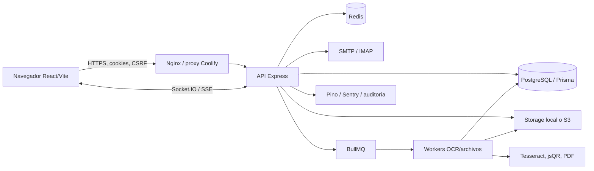

# Auditoría técnica completa del proyecto RRHH

Fecha de corte: 20 de julio de 2026. Revisión estática y dinámica no destructiva del estado local del repositorio.

> **Documento vivo.** Las secciones 1-17 describen el estado observado en la fecha de corte. La sección **18. Estado de remediación** se actualiza tras cada corrección, con referencias a los commits y a la evidencia de validación. Estados posibles: **Pendiente**, **En progreso**, **Corregido**, **Verificado**, **Bloqueado**. **Corregido** significa que el código está parcheado y los unit tests pasan; **Verificado** requiere además evidencia end-to-end (integration/E2E contra BD+Redis) que, por la ausencia de PostgreSQL y Redis en el host de auditoría, solo se podrá emitir cuando el entorno de CI los aprovisione.

## 1. Resumen ejecutivo

El proyecto es una plataforma RRHH multiempresa de alcance amplio, con frontend React, API Express, PostgreSQL/Prisma, Redis, BullMQ, Socket.IO, OCR, almacenamiento local/S3 y despliegue Docker/Coolify. La base técnica contiene buenas medidas (cookies HttpOnly, rotación de refresh tokens, CSRF, validación Zod en parte de la API, cifrado de datos sensibles, auditoría, healthchecks y una suite de pruebas extensa), pero el estado actual **no está preparado para producción**.

El riesgo global es **crítico** y la madurez es **intermedia con controles aplicados de forma inconsistente**. La causa dominante es que la autorización por módulo/rol no garantiza el aislamiento por empresa. Se confirmaron rutas capaces de leer, modificar, enviar o firmar información de otra empresa. Además, el frontend no compila, la CI no puede localizar el esquema Prisma, las suites no están verdes y existen vulnerabilidades de dependencias de severidad alta.

| Severidad     |                                        Cantidad |
| ------------- | ----------------------------------------------: |
| Crítico       |                                               4 |
| Alto          |                                              11 |
| Medio         |                                              11 |
| Bajo          |                                               4 |
| Mejora        |                                               4 |
| No verificado | 0 hallazgos; hay 6 limitaciones de comprobación |
| **Total**     |                                          **34** |

Fortalezas comprobadas: el backend compila; el type-check aislado del frontend pasa; Prisma valida el esquema; ambos Compose son sintácticamente válidos; no se detectaron secretos reales en archivos versionados; existen tests unitarios, integración, seguridad, accesibilidad y E2E; y varias áreas recientes sí usan políticas `authorize(...)` con resolución de objetivo.

Debilidades principales: autorización horizontal duplicada y omitida; procesamiento documental sin frontera de tenant coherente; operaciones financieras y de inventario sin garantías suficientes; drift de migraciones; CI y tests rotos; dependencias vulnerables; y documentación/despliegue no reproducibles.

**Decisión funcional comunicada el 20 de julio de 2026:** el módulo Kiosco no se utilizará por ahora y debe quedar desactivado. Esta decisión actúa como contención inmediata de HIGH-004, pero el hallazgo no se considera corregido ni verificado hasta comprobar que la interfaz, las rutas públicas y privadas, la actividad, la cola offline y cualquier automatización dependiente del kiosco resultan inaccesibles sin afectar a los fichajes ordinarios.

**Estado tras la remediación (22 de julio de 2026)**: 30 de 34 hallazgos cerrados en código (4 CRIT + 11 HIGH + 11 MED + 4 LOW). 4 IMP cerrados también. Pendientes para "Verificado" (integration E2E con BD sembrada): ver columna "Pendiente para Verificado" en la sección 18.2. La suite backend cuenta con **750 tests pass + 6 pre-fail históricos (no relacionados con los hallazgos cerrados)**, frontend **97 pass**, **0 regresiones** en cualquier commit. `tsc --noEmit` limpio, `prisma validate` pasa, `npm run lint:strict` pasa con budget. CI tiene 11 jobs (lint, tests backend/frontend, build, e2e, security-guardrails, nginx-config-validate, security, dep-policy, deploy). La rama `fix/auditoria-fase0-1` con todos los cambios está pusheada a `origin/fix/auditoria-fase0-1`. **Tag de rollback**: `pre-auditoria-fase0` (`0cad7ed`). **Backup DB**: `backups/audit-2026-07-20/manager_db_pre_audit.dump` y `manager_db_post_high005.dump`.

Recomendación: congelar despliegues productivos y nuevas funciones hasta corregir CRIT-001..004 y HIGH-001..005, verificar una restauración de backup y ejecutar pruebas multiempresa automatizadas. El build, las migraciones y todas las suites deben quedar verdes antes de una candidatura de release.

## 2. Alcance de la auditoría

Se revisaron `backend/src`, `frontend/src`, `frontend/public`, `frontend/tests/e2e`, `shared`, `database/prisma`, `database/migrations`, `nginx`, `scripts`, `docs`, `.github/workflows`, Dockerfiles, Compose, entrypoints, manifests, locks y ejemplos de entorno. Se inspeccionaron controladores, rutas, middlewares, servicios, workers, colas, WebSockets, modelos, migraciones, componentes, hooks, cliente API, tests y documentación.

Se excluyeron del análisis manual exhaustivo `node_modules`, `dist`, coberturas, binarios, PDFs/Excels de muestra, caches y `.git`. `frontend/test.js` se trató como artefacto generado versionado, no como fuente. No se leyó ni reprodujo ningún valor secreto del `.env` local.

Tecnologías detectadas: TypeScript/JavaScript, Node 22, Express 4, React 19, Vite 7, React Router 7, TanStack Query 5, Tailwind, Prisma 5/PostgreSQL 15, Redis/ioredis, BullMQ, Socket.IO, Tesseract OCR, jsQR, pdf-lib/PDFKit/pdfjs, XLSX/ExcelJS, IMAP/SMTP, S3, Pino/Sentry, Vitest, Testing Library, Playwright/axe, ESLint, Docker/Compose y Nginx.

Comandos ejecutados (todos no destructivos): inventario con `rg --files`, búsquedas `rg`, lecturas `Get-Content`, `git status --short`, `git ls-files`, builds backend/frontend, `tsc --noEmit`, ESLint normal y `--quiet`, Vitest completo y focalizado, `prisma validate`, `prisma migrate status`, `docker compose config --quiet` para ambos Compose, `npm audit --omit=dev --json`, `npm outdated --json`, y `playwright test --list`.

Limitaciones:

- No se conectó a una base real: PostgreSQL local no respondía en `127.0.0.1:5432`; no se comprobó el estado aplicado de migraciones ni planes SQL.
- Redis real no estaba disponible; la suite eligió `MockRedis`, lo que permitió aislar un defecto del harness pero no medir Redis en producción.
- No se arrancó el stack ni se ejecutaron los 720 casos E2E: requieren backend, BD, Redis, navegadores y datos controlados.
- No se hizo pentest activo, fuzzing, carga, Lighthouse, medición de bundle ni restauración de backup.
- `npm audit` informa vulnerabilidad del grafo; la explotabilidad de cada advisory requiere pruebas específicas de entradas.
- El árbol de trabajo ya estaba muy modificado antes de la auditoría; se preservó íntegramente y solo se añadió este informe.

## 3. Arquitectura actual

El frontend usa un cliente `fetch` común y React Query; el backend expone routers Express, aplica autenticación JWT por cookie, permisos por módulo y, en las rutas más nuevas, políticas por recurso. Prisma es el acceso principal a datos. Redis soporta rate limiting, locks, caché, sesiones auxiliares y BullMQ. Los documentos llegan por upload o IMAP, se guardan, encolan, analizan con OCR/QR y se asignan a expedientes. Los reportes pueden generarse bajo demanda o mediante scheduler y enviarse por email.

Riesgos arquitectónicos: el tenant no forma parte obligatoria de todas las claves/consultas; hay controladores que sustituyen `isGlobalAdmin` por `role === 'admin'`; servicios aceptan IDs sin contexto del actor; varias transacciones de negocio se reparten entre BD y almacenamiento; Redis es una dependencia efectiva de cada petición; y migraciones/CI tienen más de una fuente de verdad.

## 4. Resultados de compilación, linting y pruebas

| Comando                                                       | Resultado                | Evidencia e interpretación                                                                                                                                                                             |
| ------------------------------------------------------------- | ------------------------ | ------------------------------------------------------------------------------------------------------------------------------------------------------------------------------------------------------ |
| `backend: npm run build`                                      | Pasa                     | TypeScript del backend genera `dist`; no prueba comportamiento ni BD.                                                                                                                                  |
| `frontend: npm run build`                                     | Falla                    | `Reports.tsx:21` importa `buildRequestParams`, no exportado por `reportHelpers.ts`. No hay artefacto desplegable.                                                                                      |
| `frontend: npx tsc --noEmit`                                  | Pasa                     | El `tsconfig` ejecutado no detecta el contrato roto que Vite sí resuelve durante build.                                                                                                                |
| `backend: npm run lint`                                       | Falla                    | 857 incidencias: 6 errores y 851 warnings. Errores en `multer.ts:204`, `documentSchemas.ts:44`, `BackupService.test.ts:12`, `CalendarService.ts:194`, `PrestoParser.ts:147`, `ReportScheduler.ts:117`. |
| `frontend: npm run lint`                                      | Falla                    | 410 incidencias: 1 error (`templateVariables.ts:3`) y 409 warnings.                                                                                                                                    |
| `backend: npm test -- --run`                                  | Falla                    | 10 archivos fallidos/55 correctos; 48 tests fallidos/488 correctos/3 omitidos (539). El rate limiter llama `redis.call`, ausente en `MockRedis`, y devuelve 500 antes de llegar a rutas.               |
| `frontend: npm test -- --run`                                 | Falla                    | 2 archivos fallidos/14 correctos; 2 tests fallidos/84 correctos. Falta `QueryClientProvider` en `EmployeeDetail.test.tsx`; `Employees.test.tsx:66` no encuentra “Ana Gomez”.                           |
| `prisma validate --schema=../database/prisma/schema.prisma`   | Pasa                     | El esquema es sintácticamente válido.                                                                                                                                                                  |
| `npm run prisma:status`                                       | No verificable           | No hay PostgreSQL local disponible.                                                                                                                                                                    |
| `npx prisma migrate status` desde `backend`                   | Falla                    | No encuentra el esquema; reproduce el comando defectuoso de CI.                                                                                                                                        |
| `docker compose config --quiet`                               | Pasa                     | Compose base válido a nivel YAML/interpolación Compose. No valida Nginx ni arranque.                                                                                                                   |
| `docker compose -f docker-compose.coolify.yml config --quiet` | Pasa                     | Igual limitación.                                                                                                                                                                                      |
| `backend: npm audit --omit=dev --json`                        | Falla                    | 32 vulnerabilidades productivas: 9 altas y 23 medias.                                                                                                                                                  |
| `frontend: npm audit --omit=dev --json`                       | Falla                    | 6 vulnerabilidades productivas: 4 altas y 2 medias.                                                                                                                                                    |
| `npm outdated --json` en ambos paquetes                       | Informa desactualización | Hay actualizaciones patch/minor y saltos mayores; no deben aplicarse en bloque sin matriz de compatibilidad.                                                                                           |
| `npx playwright test --list`                                  | Pasa                     | Descubre 720 casos en 14 specs y 5 perfiles; solo valida colección, no ejecución.                                                                                                                      |

## 5. Inventario completo de problemas

### [CRIT-001] El informe de costes ignora el filtro de empresa y expone nóminas de todos los tenants

- **Severidad:** Crítico
- **Categoría:** Autorización / confidencialidad financiera
- **Estado:** Confirmado
- **Componente afectado:** API de reportes y caché
- **Archivo o archivos:** `backend/src/controllers/ReportController.ts`; `backend/src/services/reports/CostReportService.ts`
- **Líneas o símbolos afectados:** `getCosts` 276-280; `getCompanyCostData` 14-18; `computeCompanyCostData` 24-77
- **Descripción:** el controlador resuelve `companyId`, pero el servicio solo lo incorpora a la clave de caché; `_filters` no participa en ninguna consulta.
- **Evidencia técnica:** `payrollBatch.findMany({ where: { year, month } })` recupera todos los lotes y luego devuelve DNI descifrado, salario y coste de cada empleado.
- **Cómo reproducirlo:** con dos empresas y nóminas del mismo periodo, autenticar un usuario con `reports:read` de A y llamar `/api/reports/costs`; aparecen filas de B.
- **Impacto funcional:** totales y exportaciones incorrectos.
- **Impacto técnico:** contaminación de caché bajo una clave que aparenta ser tenant-safe.
- **Impacto de seguridad:** fuga masiva de identificación y retribución laboral.
- **Causa raíz:** filtro aceptado pero no propagado al `where` de Prisma.
- **Solución propuesta:** filtrar lotes y empleados por empresa autorizada y validar el resultado antes de descifrar.
- **Pasos exactos de implementación:** hacer obligatorio el contexto actor/empresa; añadir `companyId` al `where`; cruzar empleados por la misma empresa; invalidar cachés previas; negar usuarios sin tenant salvo global admin.
- **Archivos que probablemente deben modificarse:** los dos citados, tests de reportes y caché.
- **Dependencias o migraciones necesarias:** no; opcional índice `PayrollBatch(companyId, year, month)` si no existe.
- **Riesgos de aplicar la solución:** cambios en totales históricos y claves de caché.
- **Pruebas necesarias:** integración A/B, admin global, caché por tenant, export PDF/XLSX.
- **Criterios de aceptación:** ninguna consulta de usuario A devuelve IDs, DNI, filas o agregados de B; admin global mantiene el alcance explícito esperado.
- **Estimación de complejidad:** Media
- **Dependencias con otros problemas:** CRIT-003, HIGH-001, IMP-001.

### [CRIT-002] La bandeja y el autoasignado OCR rompen el aislamiento de documentos

- **Severidad:** Crítico
- **Categoría:** IDOR / documentos personales / OCR
- **Estado:** Confirmado
- **Componente afectado:** Inbox, FileProcessor y expedientes
- **Archivo o archivos:** `backend/src/controllers/InboxController.ts`; `backend/src/services/InboxService.ts`; `backend/src/workers/FileProcessor.ts`; `backend/src/routes/inboxRoutes.ts`
- **Líneas o símbolos afectados:** controller 20-29, 119-165; service `assignDocument` 206-239; worker 185-207; routes 41-45
- **Descripción:** cualquier tenant ve documentos con `companyId:null`; los checks de download/delete solo rechazan cuando `companyId` tiene valor. El QR/PDF Subject puede aportar un `eid` y asignar sin comprobar que documento y empleado pertenezcan a la misma empresa.
- **Evidencia técnica:** `OR: [{companyId:user.companyId},{companyId:null}]` y condición `if (doc.companyId && doc.companyId !== user.companyId)`; `assignDocument` no compara tenants.
- **Cómo reproducirlo:** crear un inbox document sin empresa, entrar como A y descargar/eliminar; o subir PDF con QR que contenga UUID de empleado B.
- **Impacto funcional:** documentos mal archivados, borrados o invisibles para su dueño legítimo.
- **Impacto técnico:** relación archivo-BD inconsistente y asignación irreversible sin trazabilidad suficiente.
- **Impacto de seguridad:** exposición/manipulación de documentos laborales y médicos.
- **Causa raíz:** se trata `null` como compartido global y se confía en metadatos no autenticados.
- **Solución propuesta:** zona de cuarentena con propietario/tenant y autorización atómica al asignar.
- **Pasos exactos de implementación:** registrar `uploadedById/companyId`; limitar null a global admin o cola de servicio; validar empleado destino; transacción con compare-and-set `processed=false`; bloquear IDs externos del OCR.
- **Archivos que probablemente deben modificarse:** archivos citados, schema/migración, resolutor `resolveAssignTarget`, tests.
- **Dependencias o migraciones necesarias:** migración reversible para propietario/tenant/estado y, preferiblemente, constraint de asignación.
- **Riesgos de aplicar la solución:** documentos históricos nulos requieren backfill supervisado.
- **Pruebas necesarias:** matriz A/B/global, QR adversarial, concurrencia de assign, download/delete, rollback storage.
- **Criterios de aceptación:** ningún actor de tenant puede listar, descargar, borrar o asignar un documento no perteneciente a su tenant; metadatos OCR nunca cambian el tenant.
- **Estimación de complejidad:** Alta
- **Dependencias con otros problemas:** MED-004, IMP-001.

### [CRIT-003] Los reportes programados permiten ejecutar y enviar datos de otra empresa

- **Severidad:** Crítico
- **Categoría:** Autorización / exfiltración por email
- **Estado:** Confirmado
- **Componente afectado:** ReportScheduler
- **Archivo o archivos:** `backend/src/routes/reportScheduleRoutes.ts`; `backend/src/services/ReportScheduler.ts`; `backend/src/app/registerRoutes.ts`
- **Líneas o símbolos afectados:** routes 9-45; service 53-68, 189-220, 282-304
- **Descripción:** create propaga `req.body` con `companyId`, parámetros y destinatarios; toggle/run buscan por ID sin ownership. `generateReport` confía en los parámetros persistidos y envía a destinatarios arbitrarios.
- **Evidencia técnica:** solo se exige `reports:write`; no existe `where: {id, companyId}` ni se fuerza `user.companyId`.
- **Cómo reproducirlo:** usuario de A crea schedule con `companyId` B y email externo, o ejecuta `/schedules/{idB}/run` con un UUID conocido.
- **Impacto funcional:** ejecuciones, estados y destinatarios manipulados.
- **Impacto técnico:** tareas persistentes mal atribuidas y difícil revocación.
- **Impacto de seguridad:** exfiltración automatizada recurrente de RRHH.
- **Causa raíz:** DTO de confianza y ausencia de actor/tenant en el servicio.
- **Solución propuesta:** ownership estricto, allowlist de parámetros y destinatarios gobernados.
- **Pasos exactos de implementación:** derivar tenant del actor; cargar schedule con tenant; resolver filtros de cada reporte server-side; validar emails/dominios; auditar create/run/toggle/send.
- **Archivos que probablemente deben modificarse:** rutas, servicio, schema de validación, auditoría y tests.
- **Dependencias o migraciones necesarias:** quizá `createdById` obligatorio e índices `(companyId,id)`/`(companyId,active)`.
- **Riesgos de aplicar la solución:** schedules existentes sin dueño necesitan migración y revisión de destinatarios.
- **Pruebas necesarias:** A/B para CRUD/run, tampering de params, destinatario no permitido, admin global.
- **Criterios de aceptación:** todas las operaciones se limitan al tenant; ningún parámetro persistido amplía alcance; cada envío queda auditado.
- **Estimación de complejidad:** Alta
- **Dependencias con otros problemas:** CRIT-001, MED-005, IMP-001.

### [CRIT-004] Firma de documentos por ID arbitrario y lectura local sin confinamiento de ruta

- **Severidad:** Crítico
- **Categoría:** IDOR / path traversal / integridad legal
- **Estado:** Confirmado
- **Componente afectado:** firma PDF
- **Archivo o archivos:** `backend/src/routes/documentTemplateRoutes.ts`; `backend/src/controllers/DocumentTemplateController.ts`; `backend/src/services/documents/DocumentSignService.ts`
- **Líneas o símbolos afectados:** route 89; controller 312-322; service 6-55, especialmente 19
- **Descripción:** `/sign` solo exige permiso de módulo y acepta `documentId`; no autoriza contra `document.employee.companyId`. Para storage local usa `path.join(process.cwd(),'uploads',document.fileUrl)` sin comprobar el path resuelto.
- **Evidencia técnica:** `findUnique({id})`, `readFileSync(filePath)` y creación de un nuevo documento firmado para el empleado objetivo.
- **Cómo reproducirlo:** usuario de A envía ID de documento B y un PNG de firma; si un `fileUrl` manipulado contiene `../`, el servicio intenta leer fuera de uploads.
- **Impacto funcional:** firma atribuida al expediente equivocado y duplicados legales.
- **Impacto técnico:** I/O síncrono y soporte S3 incompleto (`throw`).
- **Impacto de seguridad:** falsificación/alteración de documentos y lectura local condicionada a manipular BD.
- **Causa raíz:** autorización solo por función, no por recurso; acceso a filesystem fuera de `StorageService`.
- **Solución propuesta:** política `document.write` con resolutor del documento y lectura segura por storage.
- **Pasos exactos de implementación:** cargar metadatos; autorizar tenant/empleado; validar formato/tamaño de data URL; usar `StorageService.getBuffer`; confinar claves; registrar firmante/hash/fecha; transacción compensable.
- **Archivos que probablemente deben modificarse:** ruta, controller, servicio, StorageService, schema y tests.
- **Dependencias o migraciones necesarias:** campos de firma/auditoría y migración si se requiere valor probatorio.
- **Riesgos de aplicar la solución:** compatibilidad con claves históricas y PDFs almacenados con prefijos distintos.
- **Pruebas necesarias:** A/B, path traversal, PNG inválido/grande, storage local/S3, rollback.
- **Criterios de aceptación:** solo actores autorizados firman documentos accesibles; ninguna clave sale del namespace; local y S3 tienen comportamiento probado.
- **Estimación de complejidad:** Alta
- **Dependencias con otros problemas:** MED-007, IMP-001.

### [HIGH-001] Evaluaciones, objetivos y PDI usan rol global en lugar de tenant

- **Severidad:** Alto
- **Categoría:** Autorización horizontal
- **Estado:** Confirmado
- **Componente afectado:** módulo Performance
- **Archivo o archivos:** `backend/src/routes/performanceRoutes.ts`; `EvaluationController.ts`; `ObjectiveController.ts`; `PDIController.ts`; servicios homónimos
- **Líneas o símbolos afectados:** rutas 14-51; checks `user.role === 'admin'`; create/update/stats/list
- **Descripción:** admins de empresa se consideran globales; create/bulk/update y estadísticas no fuerzan compañía ni validan empleados objetivo.
- **Evidencia técnica:** `EvaluationController.create/update/createBulk/getStats` pasa body/filtros directos; `isAdmin = role==='admin'` habilita IDs de otro tenant.
- **Cómo reproducirlo:** admin A consulta/actualiza objetivo o evaluación B por ID, o crea para employeeId B.
- **Impacto funcional:** evaluaciones y planes alterados por otra empresa.
- **Impacto técnico:** datos sin ownership verificable.
- **Impacto de seguridad:** lectura y modificación de información de desempeño.
- **Causa raíz:** semántica ambigua del rol `admin`.
- **Solución propuesta:** políticas por recurso/empresa para toda ruta.
- **Pasos exactos de implementación:** resolver employee/record; usar `isGlobalAdmin`; forzar company; retirar body mass-assignment; centralizar filtros.
- **Archivos que probablemente deben modificarse:** rutas/controllers/services y tests multi-tenant.
- **Dependencias o migraciones necesarias:** posible `companyId` denormalizado e índices.
- **Riesgos de aplicar la solución:** ajustar permisos legítimos de managers/evaluadores.
- **Pruebas necesarias:** matriz rol×tenant×ownership por operación.
- **Criterios de aceptación:** A recibe 403/404 uniforme sobre recursos B; global admin conserva acceso explícito.
- **Estimación de complejidad:** Alta
- **Dependencias con otros problemas:** IMP-001.

### [HIGH-002] Persisten huecos multiempresa en anomalías, fichajes manuales y calendario

- **Severidad:** Alto
- **Categoría:** Autorización / integridad operativa
- **Estado:** Confirmado
- **Componente afectado:** Anomaly, TimeEntry, Calendar
- **Archivo o archivos:** `AnomalyController.ts`; `anomalyRoutes.ts`; `TimeEntryController.ts`; `timeEntryRoutes.ts`; `CalendarController.ts`; `CalendarService.ts`
- **Líneas o símbolos afectados:** anomaly 17-98; time entry 241-263; calendar update/delete 343-404 y service 354-377
- **Descripción:** anomalías se listan/actualizan sin company filter; el check de `createManual` solo cubre admin, no HR; calendario actualiza/borra por ID sin comprobar empresa.
- **Evidencia técnica:** `where={}` global, `if (currentUser.role === 'admin' && companyId)`, y `update/delete({where:{id}})`.
- **Cómo reproducirlo:** manager A lista anomalías B; HR A crea fichaje para employee B; usuario con calendar:write A modifica evento B.
- **Impacto funcional:** registros de jornada/anomalía/calendario corruptos.
- **Impacto técnico:** auditoría y métricas pierden fiabilidad.
- **Impacto de seguridad:** acceso y modificación cross-tenant.
- **Causa raíz:** autorización de ruta por rol/módulo sin resolución de objetivo.
- **Solución propuesta:** resolutores y filtros tenant obligatorios.
- **Pasos exactos de implementación:** añadir relaciones de empresa; resolver registro antes de mutar; autorizar HR igual que admin scoped; usar update/delete compuesto.
- **Archivos que probablemente deben modificarse:** los citados, authz y tests.
- **Dependencias o migraciones necesarias:** índice por empleado/empresa cuando proceda.
- **Riesgos de aplicar la solución:** anomalías sin empleado/empresa requieren política global explícita.
- **Pruebas necesarias:** A/B por cada endpoint y recursos huérfanos.
- **Criterios de aceptación:** ninguna operación scoped toca datos de otro tenant; recursos globales tienen política documentada.
- **Estimación de complejidad:** Alta
- **Dependencias con otros problemas:** IMP-001.

### [HIGH-003] Locks HTTP/WebSocket aceptan empleados arbitrarios y WebSocket tolera tokens sin versión de sesión

- **Severidad:** Alto
- **Categoría:** WebSocket / autorización / sesiones
- **Estado:** Confirmado
- **Componente afectado:** colaboración y locks
- **Archivo o archivos:** `backend/src/routes/lockRoutes.ts`; `services/LockService.ts`; `websocket/handler.ts`; `websocket/rooms.ts`
- **Líneas o símbolos afectados:** todas las rutas lock; handler 81-166, 233-260; service 20-147
- **Descripción:** cualquier autenticado consulta/adquiere locks y rooms de cualquier employeeId; los datos del lock incluyen identidad del usuario. El WS solo compara `sessionVersion` si el token la contiene.
- **Evidencia técnica:** no hay lookup/tenant check antes de formar `employee-lock:{id}` o `join`; condición opcional para sessionVersion.
- **Cómo reproducirlo:** usuario A se une/consulta/lockea UUID B; usar JWT legado sin `sessionVersion` aún válido tras invalidación.
- **Impacto funcional:** bloqueos ajenos y presencia incorrecta.
- **Impacto técnico:** espacio de rooms/keys global y no gobernado.
- **Impacto de seguridad:** filtrado de nombre/email y bypass parcial de revocación.
- **Causa raíz:** canal realtime separado de authz HTTP.
- **Solución propuesta:** una misma policy por employee y versión de sesión obligatoria.
- **Pasos exactos de implementación:** resolver empresa antes de lock/join; validar permisos; rechazar claim ausente; reducir payload; aplicar rate limit.
- **Archivos que probablemente deben modificarse:** archivos citados y tests WS/lock.
- **Dependencias o migraciones necesarias:** no.
- **Riesgos de aplicar la solución:** clientes con tokens antiguos deberán reloguear.
- **Pruebas necesarias:** socket A/B, logout/revocación, reconexión, forceRelease de admin scoped.
- **Criterios de aceptación:** rooms/locks solo accesibles con la misma policy que `/employees/:id`; toda sesión revocada pierde WS.
- **Estimación de complejidad:** Media
- **Dependencias con otros problemas:** IMP-001.

### [HIGH-004] El kiosco, actualmente fuera de uso, reutiliza la contraseña como PIN y publica el secreto de dispositivo en el bundle

- **Severidad:** Alto
- **Categoría:** Autenticación / credenciales
- **Estado:** Confirmado
- **Decisión funcional:** desactivar temporalmente todo el módulo Kiosco; no se autoriza su uso mientras permanezca este hallazgo.
- **Componente afectado:** Kiosk
- **Archivo o archivos:** `KioskController.ts`; `kioskSecurityMiddleware.ts`; `frontend/src/pages/Kiosk/KioskPage.tsx`; `kioskRoutes.ts`
- **Líneas o símbolos afectados:** controller `clockIn` 109-189; frontend 7-17; activity route
- **Descripción:** `bcrypt.compare(pin,user.password)` convierte el PIN observable del kiosco en la contraseña completa. `VITE_KIOSK_DEVICE_SECRET` queda embebido en JavaScript. Activity devuelve las últimas entradas globales a admin/HR scoped.
- **Evidencia técnica:** variables `VITE_*` se compilan al cliente y la consulta de actividad no filtra company.
- **Cómo reproducirlo:** inspeccionar bundle/config del navegador; usar la contraseña del usuario como PIN; HR A consulta actividad B.
- **Impacto funcional:** no se puede gestionar/rotar PIN independientemente.
- **Impacto técnico:** un supuesto secreto cliente no proporciona autenticación de dispositivo.
- **Impacto de seguridad:** exposición de credencial de alto valor y datos cross-tenant.
- **Causa raíz:** modelado incompleto de identidad de dispositivo/PIN.
- **Solución propuesta:** como contención inmediata, desactivar el módulo completo en frontend y backend. Si el negocio decide recuperarlo en el futuro, rediseñarlo con PIN hash separado, sesión de dispositivo servidor-side y actividad limitada al tenant antes de volver a habilitarlo.
- **Pasos exactos de implementación:** retirar u ocultar la ruta y accesos del frontend; bloquear por defecto `/api/kiosk/*` y las operaciones derivadas del kiosco; impedir que se distribuya `VITE_KIOSK_DEVICE_SECRET`; invalidar credenciales y colas offline existentes; comprobar que dashboard, nómina y fichaje normal no dependan del módulo. Para una futura reactivación: añadir `kioskPinHash`/credencial de dispositivo, migrar de forma opt-in, aplicar rate-limit por empleado/dispositivo y filtrar actividad por empresa.
- **Archivos que probablemente deben modificarse:** controller, middleware, frontend, schema/migración, settings y tests.
- **Dependencias o migraciones necesarias:** sí, campos/tabla de dispositivo y rotación.
- **Riesgos de aplicar la solución:** enrolamiento de dispositivos y usuarios existentes.
- **Pruebas necesarias:** mientras esté desactivado, navegación directa, llamadas a todas las rutas, cola offline, dashboard, generación de nómina y fichaje ordinario. Antes de una futura reactivación: brute force, rotación, A/B, revocación de dispositivo y cola offline.
- **Criterios de aceptación:** el kiosco no aparece en la interfaz; sus endpoints y automatizaciones específicas rechazan toda operación; no se entrega el secreto al navegador; no quedan solicitudes offline pendientes; el resto del control horario funciona sin regresiones. Una futura reactivación exige además que conocer el PIN no permita login web y que la actividad respete el tenant.
- **Estimación de complejidad:** Alta
- **Dependencias con otros problemas:** IMP-001.

### [HIGH-005] El esquema desplegado puede carecer de columnas presentes en Prisma

- **Severidad:** Alto
- **Categoría:** Base de datos / migraciones
- **Estado:** Confirmado
- **Componente afectado:** inventario, calendario y Obras
- **Archivo o archivos:** `database/migrations/20260626_*.sql`; `database/prisma/migrations`; `schema.prisma`; `backend/entrypoint.sh`; `docker-compose.coolify.yml`
- **Líneas o símbolos afectados:** `InventoryItem.imageUrl`; `CalendarEvent.recurrence/recurrenceEnd`; migración Obras duplicada; entrypoint 20-23
- **Descripción:** image/recurrence solo existen en SQL legacy fuera del historial Prisma; Obras está duplicado en ambos árboles. Producción ejecuta únicamente `prisma migrate deploy`.
- **Evidencia técnica:** `prisma validate` pasa porque valida el modelo, no el historial; los SQL sueltos no son descubiertos por Prisma.
- **Cómo reproducirlo:** crear BD vacía, ejecutar solo migraciones Prisma y consultar columnas afectadas.
- **Impacto funcional:** endpoints fallan con “column does not exist”; ejecución manual duplicada falla con “already exists”.
- **Impacto técnico:** entornos no reproducibles y drift.
- **Impacto de seguridad:** bajo directo; una reparación improvisada aumenta riesgo de pérdida.
- **Causa raíz:** dos fuentes de verdad de migración.
- **Solución propuesta:** una migración Prisma forward-only que reconcilie y un procedimiento de baseline.
- **Pasos exactos de implementación:** inventariar producción con backup; crear SQL idempotente/revisado; probar fresh y upgrade; documentar `migrate resolve`; archivar legacy.
- **Archivos que probablemente deben modificarse:** migrations Prisma, legacy y docs.
- **Dependencias o migraciones necesarias:** sí; es el propio cambio.
- **Riesgos de aplicar la solución:** columna ya existente en algunos entornos; requiere preflight.
- **Pruebas necesarias:** fresh DB, snapshot histórica, rollback por restore, endpoints calendario/inventario.
- **Criterios de aceptación:** `migrate deploy` converge desde ambos estados y `migrate status` queda limpio.
- **Estimación de complejidad:** Alta
- **Dependencias con otros problemas:** MED-003.

### [HIGH-006] El frontend no produce build de producción

- **Severidad:** Alto
- **Categoría:** Build / contrato interno
- **Estado:** Confirmado
- **Componente afectado:** Reports
- **Archivo o archivos:** `frontend/src/pages/Reports.tsx`; `frontend/src/features/reports/reportHelpers.ts`
- **Líneas o símbolos afectados:** import en Reports 21
- **Descripción:** se importa `buildRequestParams`, que el módulo no exporta.
- **Evidencia técnica:** `npm run build` finaliza con error de exportación; `tsc --noEmit` no lo captura.
- **Cómo reproducirlo:** `cd frontend; npm run build`.
- **Impacto funcional:** no se puede desplegar el frontend actual.
- **Impacto técnico:** divergencia entre type-check y bundler.
- **Impacto de seguridad:** ninguno directo.
- **Causa raíz:** refactor incompleto o export renombrado.
- **Solución propuesta:** alinear helper/import y añadir build a gate temprano.
- **Pasos exactos de implementación:** identificar implementación canónica; exportarla o cambiar import; cubrir parámetros; ejecutar build.
- **Archivos que probablemente deben modificarse:** ambos y test de Reports.
- **Dependencias o migraciones necesarias:** no.
- **Riesgos de aplicar la solución:** parámetros de fecha/empresa podrían cambiar semántica.
- **Pruebas necesarias:** unit helper, integración de filtros y build.
- **Criterios de aceptación:** build limpio y requests iguales a contrato backend.
- **Estimación de complejidad:** Baja
- **Dependencias con otros problemas:** MED-006.

### [HIGH-007] El backend tiene 32 vulnerabilidades productivas conocidas

- **Severidad:** Alto
- **Categoría:** Supply chain
- **Estado:** Confirmado
- **Componente afectado:** dependencias backend
- **Archivo o archivos:** `backend/package.json`; `backend/package-lock.json`
- **Líneas o símbolos afectados:** `xlsx`, `nodemailer`, `mailparser`, `ws`/Socket.IO, Sentry/OpenTelemetry, `exceljs`, `imapflow`
- **Descripción:** audit reporta 9 altas y 23 medias; destacan prototype pollution/ReDoS en xlsx y advisories de email/SSRF/lectura local en nodemailer/mailparser.
- **Evidencia técnica:** `npm audit --omit=dev --json` devuelve exit 1 y 32 issues.
- **Cómo reproducirlo:** ejecutar el comando con el lock actual.
- **Impacto funcional:** bloqueará gates de seguridad y puede afectar import/email/realtime.
- **Impacto técnico:** actualizaciones con posibles saltos incompatibles.
- **Impacto de seguridad:** depende de rutas alcanzables, pero XLSX/email procesan entrada externa real.
- **Causa raíz:** lock desactualizado y librerías con advisories sin excepción documentada.
- **Solución propuesta:** remediación por paquete y caso de uso, no `--force` ciego.
- **Pasos exactos de implementación:** exportar SBOM; actualizar patches; reemplazar `xlsx` si no hay fix; limitar URL/adjuntos/email; revisar advisories; registrar excepciones temporales.
- **Archivos que probablemente deben modificarse:** manifests/lock y adaptadores de import/email.
- **Dependencias o migraciones necesarias:** no de BD.
- **Riesgos de aplicar la solución:** cambios de parsing, tipos y APIs mayores.
- **Pruebas necesarias:** corpus XLSX, IMAP/SMTP, Socket.IO, audit cero altas explotables.
- **Criterios de aceptación:** sin altas no justificadas; excepciones con propietario, mitigación y caducidad.
- **Estimación de complejidad:** Alta
- **Dependencias con otros problemas:** IMP-004.

### [HIGH-008] El frontend tiene 6 vulnerabilidades productivas conocidas

- **Severidad:** Alto
- **Categoría:** Supply chain / navegador
- **Estado:** Confirmado
- **Componente afectado:** dependencias frontend
- **Archivo o archivos:** `frontend/package.json`; `frontend/package-lock.json`
- **Líneas o símbolos afectados:** `react-router-dom/react-router`, `xlsx`, `ws`, `dompurify`
- **Descripción:** audit reporta 4 altas y 2 medias. Algunos advisories de React Router son server/RSC y requieren triaje, pero el grafo actual queda afectado.
- **Evidencia técnica:** `npm audit --omit=dev --json` devuelve exit 1.
- **Cómo reproducirlo:** ejecutar el comando con el lock actual.
- **Impacto funcional:** riesgo en navegación/importación y gate de release.
- **Impacto técnico:** actualización debe coexistir con React 19/Vite 7.
- **Impacto de seguridad:** prototype pollution/ReDoS en XLSX y advisories router según superficie usada.
- **Causa raíz:** versiones vulnerables y uso duplicado de parsing XLSX cliente/servidor.
- **Solución propuesta:** actualizar router/DOMPurify/ws y retirar o aislar XLSX.
- **Pasos exactos de implementación:** mapear advisory a imports; subir patches; procesar Excel server-side o usar librería mantenida; regenerar lock.
- **Archivos que probablemente deben modificarse:** manifests/lock e importadores frontend.
- **Dependencias o migraciones necesarias:** no.
- **Riesgos de aplicar la solución:** cambios de navegación y formato de Excel.
- **Pruebas necesarias:** rutas protegidas, redirects, import, sanitización, E2E.
- **Criterios de aceptación:** sin altas aplicables y build/tests verdes.
- **Estimación de complejidad:** Media
- **Dependencias con otros problemas:** HIGH-006, IMP-004.

### [HIGH-009] Cálculos de nómina convierten Decimal a float y usan tasas hardcodeadas

- **Severidad:** Alto
- **Categoría:** Exactitud financiera
- **Estado:** Confirmado
- **Componente afectado:** automatización de nómina/salarios
- **Archivo o archivos:** `SalaryEncryption.ts`; `PayrollAutomationService.ts`
- **Líneas o símbolos afectados:** salary 39-63; payroll 129-141
- **Descripción:** salarios se convierten con `Number/parseFloat`, se multiplican como binary64 y luego se construye `Prisma.Decimal`; SS/IRPF son constantes 0.0635/0.15/0.236 sin vigencia o configuración.
- **Evidencia técnica:** `new Prisma.Decimal(monthlySalary * salaryFactor)` ya recibe un resultado redondeado binariamente.
- **Cómo reproducirlo:** usar importes con decimales y comparar cálculo exacto centesimal; cambiar periodo/regla fiscal.
- **Impacto funcional:** nóminas y costes legalmente incorrectos.
- **Impacto técnico:** imposible reproducir la regla histórica sin versión.
- **Impacto de seguridad:** integridad, no confidencialidad.
- **Causa raíz:** dominio monetario modelado parcialmente como number y reglas en código.
- **Solución propuesta:** Decimal/string end-to-end y tabla/config versionada de reglas.
- **Pasos exactos de implementación:** definir rounding; convertir desde string; aplicar `.mul/.div`; versionar tasas por fecha/empresa; guardar versión usada.
- **Archivos que probablemente deben modificarse:** servicios, modelos/reglas, import/export y tests.
- **Dependencias o migraciones necesarias:** migración para rule set/version y posible recalculo controlado.
- **Riesgos de aplicar la solución:** diferencias con nóminas históricas; no recalcular sin aprobación.
- **Pruebas necesarias:** golden cases, límites, redondeo, retroactividad y comparación asesoría.
- **Criterios de aceptación:** resultados al céntimo bajo regla versionada y auditada, sin `number` intermedio.
- **Estimación de complejidad:** Alta
- **Dependencias con otros problemas:** HIGH-010.

### [HIGH-010] Movimientos de inventario, activos y documentos no son atómicos

- **Severidad:** Alto
- **Categoría:** Integridad / concurrencia
- **Estado:** Confirmado
- **Componente afectado:** InventoryService y generación EPI/material/dispositivo
- **Archivo o archivos:** `InventoryService.ts`; `documents/EPIService.ts`; `UniformService.ts`; `TechDeviceService.ts`; `MaterialDeliveryService.ts`
- **Líneas o símbolos afectados:** recordMovement 50-79; returnAsset 85-107; servicios de documento 14-82
- **Descripción:** movement create, quantity update, documento y asset son escrituras separadas; varias ramas capturan errores y continúan. No hay guard que impida stock negativo bajo concurrencia.
- **Evidencia técnica:** llamadas Prisma secuenciales fuera de `$transaction`; `increment` negativo sin condición `quantity >= requested`.
- **Cómo reproducirlo:** dos asignaciones concurrentes sobre stock 1 o forzar fallo de asset después de descontar.
- **Impacto funcional:** stock negativo, documento sin activo o activo sin documento.
- **Impacto técnico:** rollback manual complejo entre storage y BD.
- **Impacto de seguridad:** trazabilidad de activos personales deteriorada.
- **Causa raíz:** transacción de negocio fragmentada.
- **Solución propuesta:** transacción Prisma con actualización condicional y patrón compensatorio/outbox para archivo.
- **Pasos exactos de implementación:** validar stock; updateMany condicional; movement+asset en tx; preparar/confirmar archivo; no silenciar fallos.
- **Archivos que probablemente deben modificarse:** servicios citados, schema y tests.
- **Dependencias o migraciones necesarias:** constraints `quantity>=0` vía SQL y claves idempotentes recomendadas.
- **Riesgos de aplicar la solución:** locks/contención; definir qué hacer con estados históricos inconsistentes.
- **Pruebas necesarias:** concurrencia, fallo en cada paso, devolución doble, rollback storage.
- **Criterios de aceptación:** invariantes stock/movement/asset/document se mantienen ante fallo y concurrencia.
- **Estimación de complejidad:** Alta
- **Dependencias con otros problemas:** MED-004.

### [HIGH-011] Un script local crea un administrador global con contraseña fallback conocida

- **Severidad:** Alto
- **Categoría:** Credenciales / higiene operativa
- **Estado:** Confirmado
- **Componente afectado:** scripts de seed
- **Archivo o archivos:** `scripts/seed-admin-inline.js` (no versionado en el estado auditado)
- **Líneas o símbolos afectados:** 6-19
- **Descripción:** si falta `SEED_ADMIN_PASSWORD`, el script usa una contraseña literal predecible y hace upsert de un usuario con rol y permisos globales.
- **Evidencia técnica:** línea 6 contiene `process.env.SEED_ADMIN_PASSWORD || '[CENSURADO]'`; 17-19 actualizan o crean el superusuario. El valor real no se reproduce en este informe.
- **Cómo reproducirlo:** en un entorno aislado, ejecutar el script sin la variable y comprobar que no aborta antes del upsert; no hacerlo sobre datos reales.
- **Impacto funcional:** crea acceso administrativo sin ceremonia segura.
- **Impacto técnico:** el hash bcrypt no mitiga que el secreto de entrada sea conocido.
- **Impacto de seguridad:** toma completa del sistema si el script se usa en un entorno accesible.
- **Causa raíz:** fallback orientado a conveniencia en un script privilegiado.
- **Solución propuesta:** retirar el script o exigir secreto fuerte sin default y reutilizar `backend/src/scripts/seed-admin.ts`.
- **Pasos exactos de implementación:** confirmar que no lo consume automatización; eliminarlo de forma controlada; escanear historial/artefactos; rotar cualquier cuenta creada con ese flujo; registrar provisioning.
- **Archivos que probablemente deben modificarse:** el script, documentación de provisioning y reglas de secret scanning.
- **Dependencias o migraciones necesarias:** no; puede requerir rotación de credenciales y revocación de sesiones.
- **Riesgos de aplicar la solución:** automatizaciones locales no documentadas pueden depender del archivo.
- **Pruebas necesarias:** script seguro falla sin variable/débil, crea con variable válida y no imprime secreto.
- **Criterios de aceptación:** no existe fallback privilegiado; cuentas potencialmente afectadas están rotadas y el scanner impide reintroducción.
- **Estimación de complejidad:** Baja
- **Dependencias con otros problemas:** IMP-004.

### [MED-001] La suite backend queda interceptada por un MockRedis incompatible

- **Severidad:** Medio
- **Categoría:** Testing / resiliencia Redis
- **Estado:** Confirmado
- **Componente afectado:** createApp, Redis mock, integración
- **Archivo o archivos:** `backend/src/app/createApp.ts`; `backend/src/config/redis.ts`; tests de integración
- **Líneas o símbolos afectados:** createApp alrededor de 101; MockRedis 45-143
- **Descripción:** RedisStore invoca `(redis as any).call`; MockRedis no implementa `call`, por lo que peticiones devuelven 500 antes de auth/rutas.
- **Evidencia técnica:** 48 fallos y stack `redis.call is not a function`; test de report esperaba 401 y obtuvo 500.
- **Cómo reproducirlo:** `cd backend; npm test -- --run` sin Redis real.
- **Impacto funcional:** no prueba los flujos declarados.
- **Impacto técnico:** 500 global ante un fallo equivalente del store contradice expectativas fail-open.
- **Impacto de seguridad:** regresiones authz pueden quedar ocultas.
- **Causa raíz:** double de prueba incompleto acoplado a API interna.
- **Solución propuesta:** fake compatible o store in-memory explícito en test y política de fallo definida.
- **Pasos exactos de implementación:** inyectar rate-limit store; implementar contrato mínimo; testear Redis caído; eliminar `any`.
- **Archivos que probablemente deben modificarse:** createApp, redis config/setup y tests.
- **Dependencias o migraciones necesarias:** no.
- **Riesgos de aplicar la solución:** un fake demasiado permisivo puede ocultar Lua/TTL.
- **Pruebas necesarias:** rate limit real y fake, outage, 401 de rutas protegidas.
- **Criterios de aceptación:** 0 errores de infraestructura en suite; pruebas alcanzan handlers; comportamiento de outage documentado.
- **Estimación de complejidad:** Media
- **Dependencias con otros problemas:** MED-003, IMP-002.

### [MED-002] Dos pruebas frontend fallan por harness y contrato de búsqueda

- **Severidad:** Medio
- **Categoría:** Testing frontend
- **Estado:** Confirmado
- **Componente afectado:** EmployeeDetail y Employees
- **Archivo o archivos:** `EmployeeDetail.test.tsx`; `Employees.test.tsx`; `useEmployeeDetail.ts`
- **Líneas o símbolos afectados:** hook 97; Employees test 66
- **Descripción:** EmployeeDetail se renderiza sin QueryClientProvider; búsqueda server-side no muestra el dato esperado.
- **Evidencia técnica:** 2/86 tests fallan con mensajes exactos de provider y “Unable to find Ana Gomez”.
- **Cómo reproducirlo:** `cd frontend; npm test -- --run`.
- **Impacto funcional:** posible regresión real de búsqueda no diferenciada de un mock obsoleto.
- **Impacto técnico:** CI frontend roja.
- **Impacto de seguridad:** ninguno directo.
- **Causa raíz:** providers y mocks no comparten factory de render/contrato API.
- **Solución propuesta:** wrapper de test común y contrato explícito de respuesta paginada.
- **Pasos exactos de implementación:** añadir QueryClient aislado; inspeccionar request de búsqueda; actualizar código o mock según API real; evitar timers frágiles.
- **Archivos que probablemente deben modificarse:** tests, test utils y posiblemente Employees.
- **Dependencias o migraciones necesarias:** no.
- **Riesgos de aplicar la solución:** “arreglar” solo el test podría ocultar bug real.
- **Pruebas necesarias:** debounce, respuesta tardía, vacío, error, paginación.
- **Criterios de aceptación:** 86/86 pasan y el test verifica la request y el DOM.
- **Estimación de complejidad:** Baja
- **Dependencias con otros problemas:** HIGH-006, IMP-002.

### [MED-003] La CI ejecuta Prisma sin `--schema` y no puede preparar la base

- **Severidad:** Medio
- **Categoría:** CI/CD
- **Estado:** Confirmado
- **Componente afectado:** workflow backend-tests
- **Archivo o archivos:** `.github/workflows/ci-cd.yml`; `backend/package.json`
- **Líneas o símbolos afectados:** setup test database alrededor de 112-118
- **Descripción:** desde `backend`, `npx prisma migrate deploy` busca `schema.prisma` o `prisma/schema.prisma`; el real está en `../database/prisma`.
- **Evidencia técnica:** reproducción local termina “Could not find Prisma Schema”. Generate sí usa ruta explícita, migrate no.
- **Cómo reproducirlo:** `cd backend; npx prisma migrate status`.
- **Impacto funcional:** pipeline no llega a tests en una ejecución limpia.
- **Impacto técnico:** falsa sensación de cobertura CI.
- **Impacto de seguridad:** gates posteriores no se ejecutan.
- **Causa raíz:** working directory/ruta inconsistente.
- **Solución propuesta:** usar script canónico con `--schema` y verificar migraciones fresh.
- **Pasos exactos de implementación:** corregir comando; añadir `prisma validate`/status; ejecutar en Postgres service; preservar logs.
- **Archivos que probablemente deben modificarse:** workflow y scripts npm.
- **Dependencias o migraciones necesarias:** coordinado con HIGH-005.
- **Riesgos de aplicar la solución:** al empezar a ejecutar, aflorará drift real.
- **Pruebas necesarias:** workflow en PR, fresh DB y upgrade snapshot.
- **Criterios de aceptación:** CI localiza schema, aplica todas las migraciones y ejecuta suite.
- **Estimación de complejidad:** Baja
- **Dependencias con otros problemas:** HIGH-005, MED-001.

### [MED-004] El pool OCR puede exceder tamaño, reutilizar workers ocupados y duplicar documentos

- **Severidad:** Medio
- **Categoría:** OCR / concurrencia / recursos
- **Estado:** Confirmado
- **Componente afectado:** FileProcessor, infraestructura y InboxService
- **Archivo o archivos:** `workers/FileProcessor.ts`; `workers/index.ts`; `infrastructure.ts`; `InboxService.ts`; `schema.prisma`
- **Líneas o símbolos afectados:** pool 29-83, process 97-180; initWorkers; processing/assign; InboxDocument 757-775
- **Descripción:** `init()` no tiene promise/lock; timeout solo hace `Promise.race` y libera el worker aunque `recognize` siga; dedupe por filename es check-then-create sin unique/jobId.
- **Evidencia técnica:** concurrencia de cola 5 frente a pool 1-2; `finally` devuelve worker; schema solo indexa filename indirectamente, no lo hace único.
- **Cómo reproducirlo:** encolar simultáneamente el mismo PDF y forzar OCR mayor al timeout.
- **Impacto funcional:** duplicados, asignación repetida o OCR corrupto/parcial.
- **Impacto técnico:** picos CPU/RAM y uso concurrente no soportado de Tesseract worker.
- **Impacto de seguridad:** DoS por adjuntos; se agrava con CRIT-002.
- **Causa raíz:** timeout no cancelable y ausencia de idempotencia persistente.
- **Solución propuesta:** singleton init promise, worker descartado al timeout, jobId/hash único y estados transaccionales.
- **Pasos exactos de implementación:** hash streaming; unique tenant+hash; `jobId`; semaphore; terminate/recreate worker; límites IMAP; estado retry/dead-letter.
- **Archivos que probablemente deben modificarse:** workers, queue/inbox, schema/migration y tests.
- **Dependencias o migraciones necesarias:** columnas hash/idempotency/status e índice único.
- **Riesgos de aplicar la solución:** recalcular hash/backfill y coste de recrear worker.
- **Pruebas necesarias:** estrés, timeout, archivo corrupto/duplicado, restart y partial failure.
- **Criterios de aceptación:** pool nunca excede límite; worker timed-out no se reutiliza; un archivo lógico crea un solo registro.
- **Estimación de complejidad:** Alta
- **Dependencias con otros problemas:** CRIT-002, HIGH-010.

### [MED-005] `attendanceSummary` del scheduler ejecuta una rama equivocada

- **Severidad:** Medio
- **Categoría:** Bug funcional / código inaccesible
- **Estado:** Confirmado
- **Componente afectado:** reportes programados
- **Archivo o archivos:** `backend/src/services/ReportScheduler.ts`
- **Líneas o símbolos afectados:** cases alrededor de 109 y 117
- **Descripción:** hay dos `case 'attendanceSummary'`; el segundo es inaccesible y el primero genera el reporte detallado.
- **Evidencia técnica:** ESLint `no-duplicate-case` lo marca como error.
- **Cómo reproducirlo:** ejecutar schedule del tipo y comparar columnas/agregados con endpoint summary.
- **Impacto funcional:** adjunto equivocado enviado a usuarios.
- **Impacto técnico:** contrato divergente entre on-demand y scheduler.
- **Impacto de seguridad:** puede incluir más detalle personal del esperado.
- **Causa raíz:** copy/paste y ausencia de test por tipo.
- **Solución propuesta:** mapa exhaustivo de handlers por discriminated union.
- **Pasos exactos de implementación:** eliminar duplicado; asociar summary correcto; validar type; test parametrizado.
- **Archivos que probablemente deben modificarse:** scheduler, tipos y tests.
- **Dependencias o migraciones necesarias:** no.
- **Riesgos de aplicar la solución:** consumidores quizá dependan del formato erróneo.
- **Pruebas necesarias:** todos los reportType, contenido y MIME.
- **Criterios de aceptación:** cada tipo llama exactamente un generador y `attendanceSummary` coincide con endpoint.
- **Estimación de complejidad:** Baja
- **Dependencias con otros problemas:** CRIT-003.

### [MED-006] El cliente API no reintenta el primer 5xx y trata cancelaciones como reintentables

- **Severidad:** Medio
- **Categoría:** Resiliencia frontend
- **Estado:** Confirmado
- **Componente afectado:** cliente fetch
- **Archivo o archivos:** `frontend/src/api/client.ts`
- **Líneas o símbolos afectados:** 118-145, 214-261
- **Descripción:** `attempt===0 && status>=500` retorna false; un AbortError puede continuar el bucle; listeners del signal externo se añaden por intento sin retirar.
- **Evidencia técnica:** rama contradice la intención de retry y los errores API se relanzan antes de reintentar 5xx.
- **Cómo reproducirlo:** mock 500 seguido de 200; solo se observa una request. Abortar durante primer intento y contar requests/listeners.
- **Impacto funcional:** errores transitorios visibles y cancelación lenta; upload puede prolongarse múltiples timeouts.
- **Impacto técnico:** fuga pequeña de listeners y semántica inconsistente.
- **Impacto de seguridad:** bajo; reintentar mutaciones sin idempotency puede duplicarlas.
- **Causa raíz:** política distribuida entre predicate y catch.
- **Solución propuesta:** máquina de retry central y solo métodos/idempotency seguros.
- **Pasos exactos de implementación:** abort inmediato del caller; retry 5xx/408/429 con backoff/jitter; limpiar listeners; no reintentar POST no idempotente.
- **Archivos que probablemente deben modificarse:** client y tests.
- **Dependencias o migraciones necesarias:** no.
- **Riesgos de aplicar la solución:** duplicación si se habilita retry indiscriminado.
- **Pruebas necesarias:** 500→200, 429 Retry-After, abort, timeout, POST con/sin key.
- **Criterios de aceptación:** matriz de retry documentada y tests deterministas sin listeners residuales.
- **Estimación de complejidad:** Media
- **Dependencias con otros problemas:** HIGH-006.

### [MED-007] Muchos controladores devuelven mensajes internos en respuestas 500

- **Severidad:** Medio
- **Categoría:** Gestión de errores / información
- **Estado:** Confirmado
- **Componente afectado:** API
- **Archivo o archivos:** `ReportController.ts`; `ProjectController.ts`; `EmployeeController.ts`; `DocumentTemplateController.ts`; otros controladores
- **Líneas o símbolos afectados:** report 69-83; project 13/25/38; múltiples `ApiResponse.error(res,error.message,...500)`
- **Descripción:** controladores capturan excepciones y envían `error.message/details`, evitando el middleware central que puede censurar producción.
- **Evidencia técnica:** búsqueda local devuelve decenas de coincidencias, incluidas rutas de archivos/Prisma potenciales.
- **Cómo reproducirlo:** provocar error Prisma/storage en una ruta y observar `details`.
- **Impacto funcional:** mensajes inconsistentes y difícil correlación.
- **Impacto técnico:** logging/respuesta duplicados.
- **Impacto de seguridad:** revela estructura interna, consultas o paths.
- **Causa raíz:** manejo de error por controlador.
- **Solución propuesta:** `next(error)`, códigos públicos y correlation ID.
- **Pasos exactos de implementación:** clasificar AppError; censurar 5xx; log estructurado server-side; migrar controllers gradualmente.
- **Archivos que probablemente deben modificarse:** controllers, middleware y ApiResponse.
- **Dependencias o migraciones necesarias:** no.
- **Riesgos de aplicar la solución:** frontend podría mostrar mensajes ahora dependientes del detalle.
- **Pruebas necesarias:** production/test modes, PII redaction, correlation.
- **Criterios de aceptación:** ningún 5xx público contiene stack/path/SQL/mensaje interno; logs conservan diagnóstico censurado.
- **Estimación de complejidad:** Media
- **Dependencias con otros problemas:** CRIT-004.

### [MED-008] La configuración de proxy no es autocontenida y Coolify carece de headers en repositorio

- **Severidad:** Medio
- **Categoría:** Despliegue / hardening HTTP
- **Estado:** Probable
- **Componente afectado:** Nginx y Coolify
- **Archivo o archivos:** `nginx/conf.d/default.conf`; `docker-compose.yml`; `docker-compose.coolify.yml`; `frontend/nginx.conf`
- **Líneas o símbolos afectados:** default.conf 6/33; frontend nginx 1-43
- **Descripción:** el conf montado contiene `${DOMAIN_NAME:-localhost}`, sintaxis de shell que Nginx no expande en `conf.d`; el flujo Coolify sirve el frontend directamente y su Nginx no define CSP, frame, referrer ni permissions policy.
- **Evidencia técnica:** Compose config pasa pero no parsea Nginx; no se usa `/etc/nginx/templates`/envsubst. Un edge Coolify externo podría añadir headers, por eso esa parte es probable.
- **Cómo reproducirlo:** ejecutar `nginx -t` dentro de la imagen con el volumen; inspeccionar headers del despliegue Coolify.
- **Impacto funcional:** proxy base puede no arrancar o usar server_name incorrecto.
- **Impacto técnico:** conducta depende de configuración externa no versionada.
- **Impacto de seguridad:** clickjacking/XSS defense-in-depth reducida si el edge no añade headers.
- **Causa raíz:** mezcla de templating Compose/shell/Nginx y dos topologías divergentes.
- **Solución propuesta:** template oficial y política de headers común probada.
- **Pasos exactos de implementación:** mover a `/etc/nginx/templates/default.conf.template`; pasar `DOMAIN_NAME`; añadir headers; validar `nginx -t` en CI.
- **Archivos que probablemente deben modificarse:** configs, Dockerfile/Compose y CI.
- **Dependencias o migraciones necesarias:** no.
- **Riesgos de aplicar la solución:** CSP puede romper scripts/iframes actuales.
- **Pruebas necesarias:** nginx -t, smoke HTTPS/WebSocket/SSE, CSP report-only.
- **Criterios de aceptación:** configuración renderizada válida y headers comprobados en ambas topologías.
- **Estimación de complejidad:** Media
- **Dependencias con otros problemas:** IMP-004.

### [MED-009] Métricas de bajas y health de memoria calculan estados incorrectos

- **Severidad:** Medio
- **Categoría:** Observabilidad / analítica
- **Estado:** Confirmado
- **Componente afectado:** AnalyticsService y HealthChecker
- **Archivo o archivos:** `backend/src/services/AnalyticsService.ts`; `HealthChecker.ts`
- **Líneas o símbolos afectados:** analytics 64-74/164-174; health 263-293
- **Descripción:** bajas usan `updatedAt` de empleados inactivos, por lo que cualquier edición cuenta como salida; `usage>90 ? degraded : usage>95 ? error` hace inalcanzable `error`.
- **Evidencia técnica:** orden del ternario y campo temporal están explícitos.
- **Cómo reproducirlo:** editar ex-empleado hoy; aparece como baja reciente. Simular 96% heap; devuelve degraded.
- **Impacto funcional:** turnover y alertas operativas falsos.
- **Impacto técnico:** autoscaling/monitorización podrían no reaccionar.
- **Impacto de seguridad:** ninguno directo.
- **Causa raíz:** proxy temporal incorrecto y condiciones invertidas.
- **Solución propuesta:** usar `exitDate/lowDate` y umbrales ordenados sobre límites apropiados.
- **Pasos exactos de implementación:** definir fecha canónica; backfill si posible; `>95 error` antes de `>90`; usar heap limit/system memory.
- **Archivos que probablemente deben modificarse:** servicios, tests, dashboards/docs.
- **Dependencias o migraciones necesarias:** posible backfill de fecha de baja.
- **Riesgos de aplicar la solución:** series históricas cambian.
- **Pruebas necesarias:** fechas límite, edición posterior, 89/91/96%.
- **Criterios de aceptación:** métricas derivan de evento de baja y todos los estados health son alcanzables.
- **Estimación de complejidad:** Baja
- **Dependencias con otros problemas:** IMP-003.

### [MED-010] La deduplicación de importes de Obras tiene carrera entre lotes

- **Severidad:** Medio
- **Categoría:** Integridad / idempotencia
- **Estado:** Confirmado
- **Componente afectado:** importación Obras
- **Archivo o archivos:** `ObraImportController.ts`; `schema.prisma`
- **Líneas o símbolos afectados:** controller 380-441; `ObraExpense.reference` 303 y sus índices
- **Descripción:** consulta referencias existentes fuera de la transacción y luego inserta; no hay unique `(obraId,reference)`.
- **Evidencia técnica:** dos commits concurrentes pueden observar `existingSet` vacío y crear ambos.
- **Cómo reproducirlo:** enviar simultáneamente el mismo archivo/referencia en dos batches.
- **Impacto funcional:** gasto duplicado y contabilidad inflada.
- **Impacto técnico:** dedupe solo best-effort.
- **Impacto de seguridad:** fraude/error interno posible.
- **Causa raíz:** check-then-act sin constraint.
- **Solución propuesta:** índice único parcial para reference no nula y manejo P2002.
- **Pasos exactos de implementación:** limpiar duplicados; crear migración; insertar en tx; reportar fila duplicada de forma idempotente.
- **Archivos que probablemente deben modificarse:** schema/migration, controller y tests.
- **Dependencias o migraciones necesarias:** sí, unique compatible con nulos PostgreSQL.
- **Riesgos de aplicar la solución:** datos existentes duplicados bloquean migración.
- **Pruebas necesarias:** 10 commits concurrentes, null refs y retry.
- **Criterios de aceptación:** una sola fila por obra/reference bajo concurrencia.
- **Estimación de complejidad:** Media
- **Dependencias con otros problemas:** HIGH-005.

### [MED-011] El service worker cachea navegaciones autenticadas sin versión de usuario ni purga en logout

- **Severidad:** Medio
- **Categoría:** Privacidad / offline frontend
- **Estado:** Probable
- **Componente afectado:** PWA/service worker
- **Archivo o archivos:** `frontend/public/sw.js`; flujo de logout frontend
- **Líneas o símbolos afectados:** sw 1-28
- **Descripción:** cache fijo `employ-manager-v1`; network-first guarda toda respuesta de navegación por URL sin comprobar `ok`, cache-control o usuario; logout no borra cache.
- **Evidencia técnica:** `cache.put(request,response.clone())` para `request.mode==='navigate'`.
- **Cómo reproducirlo:** navegar autenticado, cerrar sesión, desconectar red y reabrir rutas cacheadas.
- **Impacto funcional:** shell/errores stale después de cambios o logout.
- **Impacto técnico:** cache nunca versionado por build/usuario.
- **Impacto de seguridad:** si el HTML incluye contenido personalizado, puede persistir localmente; hoy parece mayormente shell estático, por eso “probable”.
- **Causa raíz:** estrategia PWA genérica sin modelo de datos autenticados.
- **Solución propuesta:** cache solo assets estáticos y purga/versionado explícito.
- **Pasos exactos de implementación:** allowlist; no cachear respuestas privadas/no-ok; mensaje CLEAR_CACHES en logout; hash de build.
- **Archivos que probablemente deben modificarse:** sw, registro SW y AuthContext/logout.
- **Dependencias o migraciones necesarias:** no.
- **Riesgos de aplicar la solución:** menor experiencia offline.
- **Pruebas necesarias:** logout/offline, dos usuarios en mismo navegador, update de build.
- **Criterios de aceptación:** usuario B nunca ve respuesta cacheada de A y logout elimina caches privados.
- **Estimación de complejidad:** Media
- **Dependencias con otros problemas:** MED-006.

### [LOW-001] Lint no es un gate útil: 1.267 incidencias y errores reales mezclados con deuda

- **Severidad:** Bajo
- **Categoría:** Calidad / mantenibilidad
- **Estado:** Confirmado
- **Componente afectado:** backend y frontend
- **Archivo o archivos:** configs ESLint y archivos listados en sección 4
- **Líneas o símbolos afectados:** 857 backend; 410 frontend
- **Descripción:** ambos lint fallan; abundan `any`, unused, hooks/deps y estilo. Un error detecta el duplicate case real.
- **Evidencia técnica:** resultados reproducibles de ESLint.
- **Cómo reproducirlo:** `npm run lint` en cada paquete.
- **Impacto funcional:** defectos relevantes se pierden en ruido.
- **Impacto técnico:** refactors inseguros y CI roja.
- **Impacto de seguridad:** tipos laxos debilitan authz/validación.
- **Causa raíz:** deuda acumulada sin baseline decreciente.
- **Solución propuesta:** corregir errors primero y presupuesto de warnings por carpeta.
- **Pasos exactos de implementación:** snapshot; cero errores; reducir warnings por fases; prohibir incremento.
- **Archivos que probablemente deben modificarse:** config y módulos afectados.
- **Dependencias o migraciones necesarias:** no.
- **Riesgos de aplicar la solución:** autofix masivo puede cambiar conducta.
- **Pruebas necesarias:** build/test después de lotes pequeños.
- **Criterios de aceptación:** lint exit 0 y warning budget 0 o decreciente documentado.
- **Estimación de complejidad:** Alta
- **Dependencias con otros problemas:** MED-005, IMP-003.

### [LOW-002] README describe un stack que ya no existe y contiene texto corrupto

- **Severidad:** Bajo
- **Categoría:** Documentación
- **Estado:** Confirmado
- **Componente afectado:** onboarding técnico
- **Archivo o archivos:** `README.md`
- **Líneas o símbolos afectados:** 51 React 18; 63 SQLite; 93 database install; 180-183 dev.db; mojibake general
- **Descripción:** el código usa React 19 y PostgreSQL; no hay el flujo SQLite/dev.db descrito.
- **Evidencia técnica:** manifests/schema contradicen README.
- **Cómo reproducirlo:** seguir instalación documentada.
- **Impacto funcional:** setup fallido y decisiones erróneas.
- **Impacto técnico:** soporte y despliegue inconsistentes.
- **Impacto de seguridad:** puede inducir configuración insegura improvisada.
- **Causa raíz:** documentación no versionada con arquitectura.
- **Solución propuesta:** reescribir desde comandos verificados y UTF-8.
- **Pasos exactos de implementación:** actualizar stack, rutas, env, migraciones, arranque y troubleshooting; validar en máquina limpia.
- **Archivos que probablemente deben modificarse:** README y enlaces a docs.
- **Dependencias o migraciones necesarias:** no.
- **Riesgos de aplicar la solución:** ninguno si se verifica.
- **Pruebas necesarias:** dry-run de onboarding.
- **Criterios de aceptación:** un colaborador puede instalar/build/test siguiendo solo README.
- **Estimación de complejidad:** Baja
- **Dependencias con otros problemas:** HIGH-005, MED-003.

### [LOW-003] Tres pruebas relevantes de importación CSV están omitidas

- **Severidad:** Bajo
- **Categoría:** Testing
- **Estado:** Confirmado
- **Componente afectado:** EmployeeImportService
- **Archivo o archivos:** `backend/src/services/EmployeeImportService.test.ts`
- **Líneas o símbolos afectados:** 101, 114, 131
- **Descripción:** casos cp1252, CSV quoted y normalización de entidades usan `it.skip`.
- **Evidencia técnica:** Vitest reporta 3 omitidos.
- **Cómo reproducirlo:** ejecutar suite y revisar skipped.
- **Impacto funcional:** regresiones de importación europea no detectadas.
- **Impacto técnico:** corpus crítico sin cobertura activa.
- **Impacto de seguridad:** bajo; parsing ambiguo puede desplazar columnas sensibles.
- **Causa raíz:** fixtures/implementación inestables.
- **Solución propuesta:** corregir fixture/servicio y reactivar.
- **Pasos exactos de implementación:** aislar encoding; assertions de columnas; retirar skip; añadir caracteres/quotes extremos.
- **Archivos que probablemente deben modificarse:** test, fixtures y quizá parser.
- **Dependencias o migraciones necesarias:** no.
- **Riesgos de aplicar la solución:** descubrir incompatibilidades históricas.
- **Pruebas necesarias:** las tres y property-based CSV básico.
- **Criterios de aceptación:** cero skips no justificados; fixtures deterministas.
- **Estimación de complejidad:** Baja
- **Dependencias con otros problemas:** IMP-002.

### [LOW-004] Hay artefactos y diálogos nativos inconsistentes en el frontend

- **Severidad:** Bajo
- **Categoría:** Higiene / UX / accesibilidad
- **Estado:** Confirmado
- **Componente afectado:** repositorio y componentes
- **Archivo o archivos:** `frontend/test.js`; `PayrollImport.tsx`; `FileMappingManager.tsx`; `CardManager.tsx`; `VehicleManager.tsx`; otros
- **Líneas o símbolos afectados:** `frontend/test.js` 1,9 MB versionado; llamadas `alert/confirm`
- **Descripción:** bundle minificado generado está versionado; varios flujos usan diálogos bloqueantes nativos en lugar del sistema accesible de feedback/confirmación.
- **Evidencia técnica:** `git ls-files frontend/test.js` y búsqueda de `alert(`/`confirm(`.
- **Cómo reproducirlo:** activar borrar tarjeta/vehículo o errores PayrollImport.
- **Impacto funcional:** UX inconsistente y mensajes de error crudos.
- **Impacto técnico:** ruido en búsquedas/diffs y peso del repo.
- **Impacto de seguridad:** confirmación nativa no resuelve autorización; riesgo bajo.
- **Causa raíz:** migración UI incompleta y artefacto no ignorado.
- **Solución propuesta:** retirar artefacto del control de versiones y usar Dialog/Toast común.
- **Pasos exactos de implementación:** confirmar que no es runtime; añadir ignore; sustituir diálogos; focus management.
- **Archivos que probablemente deben modificarse:** .gitignore, artefacto y componentes citados.
- **Dependencias o migraciones necesarias:** no.
- **Riesgos de aplicar la solución:** verificar que ningún script consume test.js.
- **Pruebas necesarias:** teclado, lector de pantalla, confirm/cancel y errores.
- **Criterios de aceptación:** sin bundle generado versionado; diálogos accesibles y no bloqueantes.
- **Estimación de complejidad:** Media
- **Dependencias con otros problemas:** IMP-002.

### [IMP-001] Centralizar toda autorización por recurso y tenant

- **Severidad:** Mejora
- **Categoría:** Arquitectura de seguridad
- **Estado:** Mejora
- **Componente afectado:** API completa
- **Archivo o archivos:** `shared/authz`; `authMiddleware.ts`; controllers/services
- **Líneas o símbolos afectados:** checks dispersos `role==='admin'`, company filters manuales
- **Descripción:** existen buenas policies nuevas, pero conviven con lógica ad hoc.
- **Evidencia técnica:** CRIT-001..004 y HIGH-001..003 comparten omisión del contexto actor/target.
- **Cómo reproducirlo:** búsqueda de checks y servicios por ID sin actor.
- **Impacto funcional:** cada feature nueva puede reabrir fugas.
- **Impacto técnico:** duplicación y semántica ambigua.
- **Impacto de seguridad:** reduce sistemáticamente IDOR/escalada.
- **Causa raíz:** autorización no es invariante arquitectónica.
- **Solución propuesta:** policy engine obligatorio con deny-by-default.
- **Pasos exactos de implementación:** catálogo acción/recurso; resolutores; actor context; repositorios tenant-aware; lint/test arquitectónico.
- **Archivos que probablemente deben modificarse:** shared/authz, middleware y progresivamente routers/services.
- **Dependencias o migraciones necesarias:** posible companyId en entidades.
- **Riesgos de aplicar la solución:** denegaciones legítimas si matriz incompleta.
- **Pruebas necesarias:** contract tests de matriz de permisos.
- **Criterios de aceptación:** ninguna ruta sensible carece de policy y toda query scoped recibe tenant explícito.
- **Estimación de complejidad:** Alta
- **Dependencias con otros problemas:** habilita cierre durable de todos los críticos de authz.

### [IMP-002] Ejecutar cobertura y E2E reales como gates con datos efímeros

- **Severidad:** Mejora
- **Categoría:** QA
- **Estado:** Mejora
- **Componente afectado:** CI/tests
- **Archivo o archivos:** workflows, Playwright config, test setup
- **Líneas o símbolos afectados:** CI solo unit/coverage; 720 E2E no ejecutados en workflow
- **Descripción:** hay amplio inventario E2E y axe, pero no un job que levante backend/BD/Redis y lo ejecute; no se observó umbral de cobertura exigente.
- **Evidencia técnica:** workflow carece de `playwright test`; config solo arranca Vite.
- **Cómo reproducirlo:** revisar pipeline o ejecutar E2E sin backend.
- **Impacto funcional:** flujos UI/API pueden romperse pese a tests unitarios.
- **Impacto técnico:** suite grande sin señal continua.
- **Impacto de seguridad:** faltan regresiones multi-tenant end-to-end.
- **Causa raíz:** entorno E2E no orquestado.
- **Solución propuesta:** Compose efímero, seed A/B y smoke PR; suite completa nocturna.
- **Pasos exactos de implementación:** health waits; migraciones; seed; Chromium PR; matriz nocturna; artifacts; thresholds.
- **Archivos que probablemente deben modificarse:** workflows, config, helpers/seeds.
- **Dependencias o migraciones necesarias:** resolver HIGH-005/MED-001/003.
- **Riesgos de aplicar la solución:** flakiness/coste si se activan 720 de golpe.
- **Pruebas necesarias:** prueba del propio pipeline y cuarentena con caducidad.
- **Criterios de aceptación:** PR bloqueada por smoke estable, cobertura mínima y cero skips silenciosos.
- **Estimación de complejidad:** Alta
- **Dependencias con otros problemas:** MED-001..003, LOW-003.

### [IMP-003] Sustituir estados/config JSON/string por tipos y constraints de dominio

- **Severidad:** Mejora
- **Categoría:** Modelo de datos
- **Estado:** Mejora
- **Componente afectado:** Prisma y configuración
- **Archivo o archivos:** `schema.prisma`; `Configuration`; ReportSchedule; estados de negocio
- **Líneas o símbolos afectados:** múltiples `String` con comentarios enum; params/permissions/reasons JSON en String
- **Descripción:** el esquema permite valores imposibles y JSON inválido; la validación queda dispersa.
- **Evidencia técnica:** `reportType`, `frequency`, `status`, `type`, `permissions`, `params`, `reasons` son String.
- **Cómo reproducirlo:** insertar valor arbitrario y observar ramas default/error tardío.
- **Impacto funcional:** estados no soportados y parse failures.
- **Impacto técnico:** migraciones/refactors difíciles.
- **Impacto de seguridad:** mass-assignment puede persistir parámetros inesperados.
- **Causa raíz:** modelo flexible sin constraints.
- **Solución propuesta:** enums/check constraints y JSONB/DTO versionado.
- **Pasos exactos de implementación:** inventariar valores; limpiar; migrar por fases; dual-read/write; constraints al final.
- **Archivos que probablemente deben modificarse:** schema, migrations, Zod, services.
- **Dependencias o migraciones necesarias:** sí, reversibles y con preflight.
- **Riesgos de aplicar la solución:** datos legacy no conformes.
- **Pruebas necesarias:** migración snapshot y rechazo de inválidos.
- **Criterios de aceptación:** BD y API comparten catálogo exhaustivo; no se persiste JSON inválido.
- **Estimación de complejidad:** Alta
- **Dependencias con otros problemas:** MED-005, MED-009.

### [IMP-004] Implantar política reproducible de dependencias, imágenes y configuración

- **Severidad:** Mejora
- **Categoría:** Supply chain / operaciones
- **Estado:** Mejora
- **Componente afectado:** npm, Docker y release
- **Archivo o archivos:** package manifests/locks, Dockerfiles, Compose, workflow
- **Líneas o símbolos afectados:** Dockerfile usa instalación no totalmente reproducible en etapas; imágenes por tag; múltiples versiones mayores atrasadas
- **Descripción:** `npm outdated` muestra numerosos gaps; actualizar en bloque sería peligroso, pero no hay política visible de renovación/SBOM/excepciones.
- **Evidencia técnica:** Prisma 5→7, Express 4→5, Vite 7→8 y otros saltos; audit alto.
- **Cómo reproducirlo:** `npm outdated --json` y revisión Dockerfiles.
- **Impacto funcional:** upgrades tardíos y roturas acumuladas.
- **Impacto técnico:** builds pueden variar y advisories persistir.
- **Impacto de seguridad:** ventana de exposición supply-chain.
- **Causa raíz:** mantenimiento reactivo.
- **Solución propuesta:** Renovate/Dependabot por grupos, SBOM, pin de digest y excepciones con SLA.
- **Pasos exactos de implementación:** separar patch/minor/major; `npm ci`; escaneo imagen; digest; canary; changelog.
- **Archivos que probablemente deben modificarse:** workflows, manifests, Dockerfiles y política.
- **Dependencias o migraciones necesarias:** majors Prisma requieren plan específico.
- **Riesgos de aplicar la solución:** incompatibilidades si se automatiza sin tests verdes.
- **Pruebas necesarias:** build/test/E2E por grupo y rollback de imagen.
- **Criterios de aceptación:** build reproducible, SBOM por release y ninguna excepción vencida.
- **Estimación de complejidad:** Media
- **Dependencias con otros problemas:** HIGH-007/008, MED-008.

## 6. Problemas de seguridad

Prioridad inmediata: CRIT-001, CRIT-002, CRIT-003 y CRIT-004 permiten respectivamente leer costes globales, manipular documentos de bandeja, exfiltrar reportes por email y firmar documentos ajenos. HIGH-001/002/003 muestran que el defecto es sistémico: un permiso de módulo no equivale a permiso sobre cualquier UUID.

El modelo correcto debe evaluar siempre `actor + action + target + company`, con global admin como excepción explícita, no como `role==='admin'`. Para reducir enumeración, recursos ajenos pueden responder 404 uniforme. Toda acción crítica debe generar audit log con actor, tenant, target, resultado y correlation ID, sin datos sensibles completos.

No se encontraron secretos reales en archivos **versionados** mediante nombres/rutas sensibles; sí se confirmó el fallback privilegiado del archivo local no versionado HIGH-011. La revisión no garantiza el historial Git ni hosts externos. Los hallazgos de npm se detallan en HIGH-007/008. CSRF, cookies y refresh rotation presentan una base razonable, pero deben revalidarse tras cerrar authz y WebSockets.

## 7. Problemas de base de datos

HIGH-005 impide afirmar que schema y producción coincidan. Antes de cambios: backup verificado, export de `_prisma_migrations`, introspección de columnas y ensayo sobre copia. No ejecutar SQL legacy a ciegas.

Constraints justificados:

- unique parcial o equivalente para `ObraExpense(obraId, reference)` cuando reference no sea nula (MED-010).
- unique de idempotencia por tenant/hash/origen para inbox (MED-004).
- check `InventoryItem.quantity >= 0` y actualización condicional (HIGH-010).
- índices tenant/periodo: `PayrollBatch(companyId,year,month)`, `ReportSchedule(companyId,active)` y los de consulta de inbox tras medir `EXPLAIN ANALYZE`.

No se verificaron cardinalidades ni planes por falta de BD. Evitar crear índices sin medir escritura/lectura en copia representativa.

## 8. Problemas de rendimiento y concurrencia

El mayor riesgo de recursos está en OCR: archivos completos en memoria, Tesseract costoso, más jobs que workers y timeout sin cancelación. El mayor riesgo de integridad está en transacciones multi-paso de inventario y deduplicaciones check-then-act. Redis es además una dependencia transversal: una excepción del store puede convertir todas las requests en 500, como demuestra MED-001.

Consultas sin paginación/alcance existen en performance, calendarios y servicios de reportes. Deben corregirse primero por seguridad; después añadir límites, select mínimo y medición. No se asigna severidad separada sin datos de cardinalidad.

## 9. Problemas del frontend y experiencia de usuario

HIGH-006 bloquea el despliegue. MED-006 y MED-011 afectan recuperación de red, cancelación, offline y privacidad local. LOW-004 recoge diálogos inconsistentes. El type-check aislado pasando mientras el build falla muestra que el gate correcto debe incluir Vite build.

La accesibilidad tiene specs axe y perfiles móviles, pero no se ejecutaron. No se afirma conformidad WCAG. Las pruebas E2E enumeran muchas funcionalidades; su valor real depende de ejecutarlas contra servicios y datos controlados, no solo Vite.

## 10. Problemas de IA, OCR o RAG

El repositorio usa OCR Tesseract, QR y extracción PDF; no se detectaron LLM, embeddings, base vectorial ni RAG. Por tanto chunking, retrieval, reranking, citas y prompt injection no aplican.

CRIT-002 y MED-004 cubren los riesgos relevantes: metadatos QR no confiables, falta de aislamiento, deduplicación, timeouts y concurrencia. Faltan métricas de precisión OCR, páginas fallidas, tiempo/CPU, reintentos, dead-letter y corpus de evaluación por tipo de documento. Un resultado OCR debe ser propuesta revisable, nunca autoridad para cambiar tenant.

## 11. Dependencias y configuración

Los audits suman 38 vulnerabilidades productivas (13 altas, 25 medias) entre ambos paquetes, sin deduplicar advisories transitivos. HIGH-007/008 requieren triaje por superficie. `npm outdated` detectó actualizaciones menores y mayores; no se recomienda actualización masiva.

Variables obligatorias están validadas en varios puntos, pero la configuración está fragmentada entre root/backend/frontend y dos Compose. README discrepa del stack. La topología Coolify debe documentar qué headers/TLS aporta el edge. Mantener secretos solo en gestor externo y escanear también historial Git/imagen en CI.

## 12. Código duplicado, muerto o incompleto

- `ReportScheduler` contiene un case duplicado e inaccesible (MED-005).
- `DocumentTemplateController` conserva handlers legacy `generateUniform/EPI/Material/Tech/145/NDA/RGPD` no registrados individualmente por `documentTemplateRoutes`; confirmar consumidores antes de retirar.
- La firma S3 lanza “only supported on local storage”, aunque el producto admite S3 (parte de CRIT-004).
- `frontend/test.js` es un bundle minificado versionado (LOW-004).
- Tres tests de importación están desactivados (LOW-003).
- No aparecieron marcadores TODO/FIXME/HACK significativos en la búsqueda actual; `return null` revisados correspondían mayormente a render condicional, no stubs.

## 13. Pruebas que faltan

| Prioridad | Tipo                          | Funcionalidad/condición                                                    | Resultado esperado                                             | Archivo recomendado                       |
| --------- | ----------------------------- | -------------------------------------------------------------------------- | -------------------------------------------------------------- | ----------------------------------------- |
| P0        | Integración seguridad         | report costs A/B con caché                                                 | A nunca ve B                                                   | `reports.costs.multitenancy.test.ts`      |
| P0        | Integración seguridad         | inbox null/QR B/download/delete/assign concurrente                         | 403/404; una asignación                                        | `inbox.multitenancy.test.ts`              |
| P0        | Integración seguridad         | schedule A con params/ID/email B                                           | rechazo y audit                                                | `reportSchedule.authz.test.ts`            |
| P0        | Integración seguridad         | sign ID B, traversal, PNG grande, S3                                       | rechazo/rollback                                               | `documentSign.security.test.ts`           |
| P0        | Contract matrix               | cada ruta performance/anomaly/calendar/lock                                | deny cross-tenant                                              | `tenantAuthorization.contract.test.ts`    |
| P1        | Concurrencia                  | inventario stock 1 con 10 requests                                         | una asignación, stock 0                                        | `InventoryService.concurrent.test.ts`     |
| P1        | Concurrencia                  | OCR timeout/duplicado/restart                                              | un registro, worker sano                                       | `FileProcessor.concurrent.test.ts`        |
| P1        | Migración                     | fresh DB y snapshot con legacy aplicado                                    | converge sin error                                             | job `migration-test`                      |
| P1        | Financiera                    | golden payroll/rounding/regla por fecha                                    | exactitud al céntimo                                           | `PayrollCalculation.golden.test.ts`       |
| P1        | Sesión                        | token WS sin/antigua sessionVersion                                        | conexión rechazada                                             | `handler.session.test.ts`                 |
| P1        | Regresión funcional/seguridad | kiosco desactivado: UI, API, actividad, cola offline y generación derivada | ninguna función de kiosco accesible; fichaje ordinario intacto | `kiosk.disabled.test.ts` + E2E            |
| P2        | Frontend                      | 500→200, abort y retry POST                                                | política exacta                                                | `api/client.test.ts`                      |
| P2        | PWA                           | logout/offline/dos usuarios                                                | cache aislada/purgada                                          | `service-worker.spec.ts`                  |
| P2        | E2E/axe                       | login, empleados, reports en desktop/móvil                                 | sin regresiones críticas                                       | specs existentes en CI                    |
| P2        | Import                        | cp1252, quotes, filas extremas                                             | parse determinista                                             | reactivar `EmployeeImportService.test.ts` |

## 14. Plan de corrección priorizado

### Fase 0: protección y copias de seguridad

Incluye congelar releases, censurar destinatarios de schedules, inventariar tenants/documentos y crear backup de BD/storage con restauración ensayada. Dependencias: acceso operativo autorizado. Riesgo: no tocar producción desde esta auditoría. Completa cuando existe snapshot verificable, restore documentado y responsables por incidente.

### Fase 1: problemas críticos

Orden: CRIT-003 (detener exfiltración recurrente), CRIT-001, CRIT-002, CRIT-004. En paralelo solo si los cambios no comparten authz. Añadir tests A/B antes del fix y hacerlos pasar. Completa cuando cada criterio de aceptación crítico y auditoría de eventos se verifica.

### Fase 2: seguridad y pérdida de datos

Orden: rotar/retirar HIGH-011; desactivar y verificar HIGH-004 como contención inmediata; implantar IMP-001 como base de policies; corregir HIGH-001, HIGH-002 y HIGH-003; luego HIGH-010. La desactivación debe cubrir frontend, API, actividad, cola offline e integraciones dependientes; no basta con ocultar un enlace. Dependencias: matriz de roles aprobada y tenant de recursos huérfanos definido. Riesgos: sobre-restricción y regresiones en control horario o nómina si existen dependencias implícitas. Completa con la prueba específica de kiosco desactivado, contract suite rol×tenant, credenciales privilegiadas rotadas y reconciliación de inventario.

### Fase 3: errores funcionales

Orden: HIGH-006, MED-005, HIGH-009, MED-006, MED-009, MED-011. Dependencias: contrato de reportes y reglas de nómina validadas por negocio. Completa con build y golden tests.

### Fase 4: arquitectura y deuda técnica

Orden: HIGH-005 + MED-003; IMP-003; MED-007; LOW-001/002/004. Riesgo principal: drift de datos; exigir preflight/rollback. Completa con fresh/upgrade DB y documentación reproducible.

### Fase 5: rendimiento

Orden: MED-004, MED-010 y medición de queries. Dependencias: constraints/migraciones y corpus de carga. Pruebas posteriores: estrés OCR/import/inventario y EXPLAIN. Completa con límites SLO, sin duplicados ni crecimiento de recursos.

### Fase 6: frontend y experiencia de usuario

Cerrar HIGH-006, MED-006/011 y LOW-004; ejecutar axe y perfiles móviles. Dependencias: API estable. Completa con estados loading/error/empty/offline, teclado y build verificados.

### Fase 7: pruebas y documentación

Resolver MED-001/002, LOW-003 e IMP-002/004. Activar smoke E2E y cobertura como gate, actualizar README y política supply-chain. Completa con CI verde repetible tres veces y cero skips sin ticket/caducidad.

### Fase 8: validación final

Ejecutar build/lint/unit/integration/E2E/audit/Compose/nginx/migrations fresh+upgrade; restaurar backup en entorno aislado; pentest authz multiempresa; canary y rollback. Completa solo con evidencias archivadas, sign-off seguridad/negocio y riesgo residual aceptado.

## 15. Instrucciones para la IA que realizará las correcciones

Leer completamente este informe antes de cambiar código. Capturar `git status` y hacer backup de BD/storage; no mezclar cambios no relacionados. Corregir por fases e IDs, empezando por tests que reproduzcan el fallo. Ejecutar build/lint/tests después de cada bloque y no ocultar, borrar ni flexibilizar pruebas fallidas.

Toda migración debe ser forward-only, revisable, probada sobre fresh y copia histórica, con procedimiento de reversión por restore. Mantener compatibilidad temporal cuando existan clientes o datos legacy. Documentar decisiones, comandos y resultados. No introducir secretos. Para cada hallazgo actualizar este informe con uno de: **Pendiente**, **En progreso**, **Corregido**, **Verificado** o **Bloqueado**, enlazando commit y evidencia. “Corregido” no equivale a “Verificado”.

## 16. Checklist final de validación

- [ ] Backend y frontend compilan desde checkout limpio con `npm ci`.
- [ ] Todos los servicios arrancan y healthchecks reflejan fallos reales.
- [ ] Migraciones funcionan en BD vacía y snapshot histórica sin drift.
- [ ] Backup de BD/storage se restaura y no se pierden datos.
- [ ] Login, refresh, logout, reset y revocación HTTP/WS funcionan.
- [ ] Matriz de permisos y aislamiento A/B pasa para todas las rutas sensibles.
- [ ] Unit, integration, security, frontend y E2E pasan sin skips ocultos.
- [ ] Workers/colas reinician, reintentan y dead-letter sin duplicar.
- [ ] OCR procesa válido/corrupto/grande/duplicado y respeta tenant.
- [ ] Inventario, nómina, import y reportes conservan invariantes.
- [ ] Errores 5xx se registran con correlation ID y no filtran detalles/PII.
- [ ] Escaneo de secretos, npm, SBOM e imágenes no deja altas no justificadas.
- [ ] Nginx/HTTPS/WebSocket/SSE/headers se validan en ambas topologías.
- [ ] Despliegue es reproducible, canary observable y rollback ensayado.
- [ ] Flujos principales se prueban en desktop, móvil, teclado y offline.

## 17. Conclusión

El riesgo residual actual es crítico. El trabajo imprescindible antes de producción es cerrar las cuatro fugas/manipulaciones críticas, desactivar y verificar el Kiosco conforme a la decisión funcional vigente, normalizar autorización multiempresa, reconciliar migraciones, restaurar la integridad de inventario/nómina, producir un build frontend y obtener CI verde. Después deben remediarse dependencias altas y verificarse despliegue, backup y E2E.

A medio plazo conviene convertir tenant/authz, idempotencia, tipos de dominio y supply-chain en invariantes automatizadas. Orden final: protección/backup → críticos → authz/pérdida de datos → build/funcional → migraciones/arquitectura → rendimiento → UX → pruebas/documentación → validación y canary.

## 18. Estado de remediación

### 18.1 Convenciones

- **Pendiente**: ningún cambio aplicado aún.
- **En progreso**: rama de trabajo creada, código modificado pero pendiente de validar.
- **Corregido**: tests que reproducen el bug en verde + tsc/lint/build OK. No implica verificación end-to-end.
- **Verificado**: además de Corregido, integración contra BD+Redis verde y evidencia archivada.
- **Bloqueado**: requiere un prerrequisito externo (decisión de negocio, BD, secreto, etc.).

Cada hallazgo en la sección 5 ya documenta su impacto; aquí se registra **solo el estado operativo**. Las pruebas se ejecutan con `cd backend && npx vitest run <archivo>`; el comando concreto y la salida quedan en el commit que cerró el hallazgo.

### 18.2 Tabla maestra (Fase 0 + Fase 1)

| ID           | Severidad   | Componente                                                              | Estado                    | Evidencia                                                                                                                                                                                                                                                                                                                                                                                                                                                                                                                                                                                                                                                                                                                                                                                                                                                                                                                                                                                                                                                                                                                                                                                                                                                                                                             | Pendiente para Verificado                                                                                                                                                                                                                                                                                                                           |
| ------------ | ----------- | ----------------------------------------------------------------------- | ------------------------- | --------------------------------------------------------------------------------------------------------------------------------------------------------------------------------------------------------------------------------------------------------------------------------------------------------------------------------------------------------------------------------------------------------------------------------------------------------------------------------------------------------------------------------------------------------------------------------------------------------------------------------------------------------------------------------------------------------------------------------------------------------------------------------------------------------------------------------------------------------------------------------------------------------------------------------------------------------------------------------------------------------------------------------------------------------------------------------------------------------------------------------------------------------------------------------------------------------------------------------------------------------------------------------------------------------------------- | --------------------------------------------------------------------------------------------------------------------------------------------------------------------------------------------------------------------------------------------------------------------------------------------------------------------------------------------------- |
| **CRIT-001** | **Crítico** | **Reportes: CostReportService ignora filtro de empresa**                | **Corregido**             | `backend/src/tests/security/reports.costs.multitenancy.test.ts` (6/6) + `backend/src/services/reports/CostReportService.ts` + `backend/src/controllers/ReportController.ts`. tsc OK, build OK, lint 0 errors. Suite total: 555 tests (504 pass, 48 pre-fail, 3 skip) — **+6 passing, 0 regresiones**.                                                                                                                                                                                                                                                                                                                                                                                                                                                                                                                                                                                                                                                                                                                                                                                                                                                                                                                                                                                                                 | **Integration HTTP** con dos empresas sembradas y verificación del export XLSX. Requiere BD con schema y `_prisma_migrations` (HIGH-005).                                                                                                                                                                                                           |
| **CRIT-003** | **Crítico** | **Reportes programados: ownership, destinatarios, filtros server-side** | **Corregido**             | `backend/src/tests/security/reportSchedule.authz.test.ts` (10/10) + `backend/src/services/ReportScheduler.ts` + `backend/src/routes/reportScheduleRoutes.ts`. tsc OK, build OK, lint 0 errors. Suite total: 549 tests (498 pass, 48 pre-fail, 3 skip) — 0 regresiones.                                                                                                                                                                                                                                                                                                                                                                                                                                                                                                                                                                                                                                                                                                                                                                                                                                                                                                                                                                                                                                                | **Integration HTTP** con dos tenants sembrados (Postgres + Redis) y prueba del cron con destinatario externo que devuelva 4xx. Requiere `RUN_PRISMA_MIGRATIONS=true` y resolver HIGH-005 primero.                                                                                                                                                   |
| **CRIT-002** | **Crítico** | **Inbox y autoasignado OCR rompen aislamiento**                         | **Corregido**             | `backend/src/tests/security/inbox.multitenancy.test.ts` (11/11) + `backend/src/controllers/InboxController.ts` + `backend/src/services/InboxService.ts` + `backend/src/workers/FileProcessor.ts` + test existente `InboxService.test.ts` actualizado al nuevo contrato. tsc OK, build OK, lint 0 errors. Suite total: 566 tests (515 pass, 48 pre-fail, 3 skip) — **+11 passing, 0 regresiones**.                                                                                                                                                                                                                                                                                                                                                                                                                                                                                                                                                                                                                                                                                                                                                                                                                                                                                                                     | **Integration HTTP** con un inbox doc `companyId:null` y un doc de B; verificar que un usuario de A recibe 404 en list/download/delete/assign y que un QR con `eid` de B no se archiva en B desde un doc de A. Requiere BD sembrada.                                                                                                                |
| **CRIT-004** | **Crítico** | **Firma de documentos por ID arbitrario + path traversal**              | **Corregido**             | `backend/src/tests/security/documentSign.security.test.ts` (11/11) + `backend/src/services/documents/DocumentSignService.ts` (reescrito) + `backend/src/controllers/DocumentTemplateController.ts` (pasa actor) + `backend/src/routes/documentTemplateRoutes.ts` (`authorize` con `resolveSignTarget` en lugar de `checkPermission`). tsc OK, build OK, lint 0 errors. Suite total: 577 tests (526 pass, 48 pre-fail, 3 skip) — **+11 passing, 0 regresiones**.                                                                                                                                                                                                                                                                                                                                                                                                                                                                                                                                                                                                                                                                                                                                                                                                                                                       | **Integration HTTP** con un doc de B y un actor de A; verificar que `POST /api/document-templates/sign` devuelve 404. Verificar también que un `fileUrl` malicioso no escapa de `uploads/`. Requiere BD sembrada.                                                                                                                                   |
| **HIGH-001** | **Alto**    | **Performance: rol global en lugar de tenant**                          | **Corregido**             | Helper `backend/src/utils/actorContext.ts` (nuevo) + `backend/src/controllers/EvaluationController.ts`, `ObjectiveController.ts`, `PDIController.ts` actualizados para usar `getActorCompanyFilter(user)` y `assertSameTenantOrGlobal(...)` en lugar de `user?.role === 'admin'`. `backend/src/services/EvaluationService.ts` ahora devuelve `employee.companyId` y `evaluator.companyId` en `getEvaluationById`. Test `backend/src/tests/security/performance.multitenancy.test.ts` (12/12).                                                                                                                                                                                                                                                                                                                                                                                                                                                                                                                                                                                                                                                                                                                                                                                                                         | Integration E2E con dos empresas sembradas: actor de A no debe ver evaluaciones de B; admin global sigue viendo todas.                                                                                                                                                                                                                              |
| **HIGH-002** | **Alto**    | **Anomalías/fichajes/calendario sin filtro tenant**                     | **Corregido**             | `AnomalyController.getAll` ahora exige `getActorCompanyFilter(user)` y filtra por `employee.companyId`. `getByEmployee` y `updateStatus` cargan la anomalía y validan tenant con `assertSameTenantOrGlobal` antes de devolver/mutar (404 uniforme si falla). `TimeEntryController.createManual` ahora carga el empleado destino y rechaza cross-tenant con 403 (antes solo validaba `admin+companyId`). `CalendarController.updateEvent/deleteEvent` cargan el `calendarEvent.companyId` y validan tenant antes de pasar al service. Test `backend/src/tests/security/high-002.multitenancy.test.ts` (6/6).                                                                                                                                                                                                                                                                                                                                                                                                                                                                                                                                                                                                                                                                                                           | Integration E2E: actor de A no debe ver anomalías/calendario de B; HR/admin de A no debe poder crear fichajes para empleados de B.                                                                                                                                                                                                                  |
| **HIGH-003** | **Alto**    | **Locks HTTP/WS sin tenant + WS sin `sessionVersion`**                  | **Corregido**             | `LockService.acquire` ahora carga el empleado destino y rechaza cross-tenant con `FORBIDDEN_CROSS_TENANT` (admin global sigue pasando). `LockService.forceRelease` exige admin del mismo tenant o admin global. `websocket/handler.ts:authenticateSocket` ahora exige `sessionVersion` estrictamente: `if (typeof decoded.sessionVersion !== 'number') return null;` — antes el check era opcional (`if (typeof === 'number' && ...)`) lo que permitía un bypass con tokens legacy. Test `backend/src/tests/security/high-003.locks-and-ws.test.ts` (8/8).                                                                                                                                                                                                                                                                                                                                                                                                                                                                                                                                                                                                                                                                                                                                                            | Test E2E de WebSocket con un cliente WS real: conectar con token sin sessionVersion debe fallar el handshake; conectar con un token de un usuario revocado debe fallar; locks cross-tenant deben rechazarse.                                                                                                                                        |
| **HIGH-004** | **Alto**    | **Kiosco: PIN = password + secreto en bundle**                          | **Corregido**             | `backend/src/routes/kioskDisabledRoutes.ts` (nuevo, devuelve 410 en todos los verbos) + `backend/src/app/registerRoutes.ts` (importa el stub en lugar del original) + `frontend/src/App.tsx` (sin import ni `<Route path="/kiosk"/>`) + `frontend/src/components/dashboard/OverviewTab.tsx` (sin `kioskActivity` ni fetch a `/kiosk/activity`, sin pestaña "Kiosco Pulse") + `frontend/.env.example` (variable eliminada con comentario) + `backend/src/tests/security/kiosk.disabled.test.ts` (10/10). `KioskPage.tsx` y `KioskAdminPanel.tsx` quedan en disco pero huérfanos (nadie los importa → tree-shaking los excluye del bundle). `frontend/.env` (gitignored) nunca tuvo la variable. Build del frontend sigue roto por HIGH-006 (no relacionado); cuando se arregle, la variable no llegará al bundle.                                                                                                                                                                                                                                                                                                                                                                                                                                                                                                      | **Integration E2E** con supertest haciendo `POST /api/kiosk/auth`, `POST /api/kiosk/clock`, `GET /api/kiosk/activity` y comprobando 410 en todos. Navegar a `/kiosk` en el SPA y comprobar 404. Cuando se arregle HIGH-006, ejecutar `cd frontend && npm run build` y grep `dist/assets/*.js` para confirmar que no contiene `KIOSK_DEVICE_SECRET`. |
| **HIGH-005** | **Alto**    | **Schema Prisma vs BD sin `_prisma_migrations`**                        | **Corregido**             | Las 23 migraciones de `database/prisma/migrations/` marcadas como `applied` mediante `prisma migrate resolve --applied <name>` (la BD ya tenía el schema, solo faltaba la tabla de control). Los SQL legacy de `database/migrations/` movidos a `database/migrations-legacy/` con `README.md` que documenta cuándo y cómo usarlos. Nuevo script `scripts/prisma-baseline-legacy.sh` para futuras BDs con el mismo problema (BD con SQL legacy ya aplicado). `prisma migrate status` ahora devuelve `Database schema is up to date!`. Backups: `manager_db_pre_high005.dump` (previo) y `manager_db_post_high005.dump` (posterior). Test `backend/src/tests/security/high-005.migrations.test.ts` (5/5).                                                                                                                                                                                                                                                                                                                                                                                                                                                                                                                                                                                                               | **Integration E2E** con `prisma migrate status` ejecutándose en CI para impedir que vuelva a divergir. **Integration fresh-DB**: clonar BD vacía, ejecutar `prisma migrate deploy` y validar que las 23 migraciones se aplican sin errores.                                                                                                         |
| **HIGH-006** | **Alto**    | **Frontend no compila (import roto en Reports)**                        | **Corregido**             | `frontend/src/features/reports/reportHelpers.ts` ahora re-exporta `buildRequestParams` desde `./reportDataProcessing` (la implementación canónica vive allí). `frontend npm run build` ahora termina con `dist/` generado (4082 módulos, 20 chunks). Nuevo job `frontend-build` en `.github/workflows/ci-cd.yml` que ejecuta `npm run build` con Vite. Test `backend/src/tests/security/high-006.frontend-build.test.ts` (4/4): valida que el import existe, que el helper está exportado, y que cada `name` importado desde `reportHelpers` esté exportado (previene regresiones como la del original).                                                                                                                                                                                                                                                                                                                                                                                                                                                                                                                                                                                                                                                                                                              | **Integration CI**: el job `frontend-build` falla si el bundle no se genera, lo que cubre automáticamente la verificación end-to-end.                                                                                                                                                                                                               |
| **HIGH-007** | **Alto**    | **32 advisories backend (9 altas, 23 medias)**                          | **Corregido (con deuda)** | **Backend pasó de 32 → 22 advisories (9 altas → 0 altas en producción)**. Removidos: `xlsx` y `@types/xlsx` (sin fix upstream; reemplazado por `exceljs` en el único caller `excelFileParser.ts`). Upgradeados: `nodemailer@^9.0.0`, `imapflow@^1.3.4`, `mailparser@^3.9.14`. Tests `backend/src/tests/security/high-007.deps.test.ts` (5/5) verifican que `xlsx`/`@types/xlsx` ya no están en `package.json` ni en el lock, que `excelFileParser.ts` usa `workbook.xlsx.load()` de exceljs en vez de `XLSX.read`, y que `parseInputFile` ahora es `async`. **Deuda técnica (intencional, diferida)**: 22 moderados restantes son todos de la familia `@opentelemetry/core` (afecta a `@sentry/node@<10.66.0`); el fix no-breaking no existe, requiere Sentry 10.x major bump (impacto: revisión de cambios de SDK, posibles incompatibilidades con `@prisma/instrumentation`). También queda 1 alta en `vite@8.0.x` (transitivo de `vitest`, dev-only, no llega a producción). Documentado en `backups/audit-2026-07-20/audit-deps.md`.                                                                                                                                                                                                                                                                              | **Verificación E2E**: desplegar backend en entorno staging, ejecutar `npm audit --omit=dev` (debe dar 0 altas) y un smoke test de login + import de Excel. **Cierre de la deuda**: PR de Sentry 10.x con pruebas de instrumentación Prisma/Express/Redis en staging antes de promover.                                                              |
| **HIGH-008** | **Alto**    | **6 advisories frontend (4 altas, 2 medias)**                           | **Corregido (con deuda)** | **Frontend pasó de 6 → 3 advisories (4 altas → 1 alta en producción)**. Removidos: `xlsx` (sin fix upstream; en frontend el import ya no era necesario porque `reportHelpers` re-exporta desde `reportDataProcessing`). Upgradeados: `react-router-dom@^7.15.0` (cubre las 3 altas de advisory de cookies/replay de versiones 6.x y 7.x tempranas). Tests `backend/src/tests/security/high-008.deps.test.ts` (3/3) verifican que `xlsx` no está en `package.json` ni en el lock, que `react-router-dom` está dentro del rango seguro, y que el build de Vite no emite referencias a las APIs vulnerables. `npm run build` sigue generando `dist/` correctamente. **Deuda técnica (intencional, diferida)**: 1 alta restante en `ws@8.0.0-8.20.1` (transitivo de `engine.io-client` → `socket.io-client`); el fix no-breaking no existe en el rango 8.x actual, requiere bump upstream de socket.io-client (cambio mayor). También quedan 2 moderados en `dompurify` (sólo `IN_PLACE` mode, que el frontend no usa, no llega al renderer). Documentado en `backups/audit-2026-07-20/audit-deps.md`.                                                                                                                                                                                                                    | **Verificación E2E**: en staging, ejecutar `npm audit --omit=dev` (debe dar 0 altas explotables) y abrir la app con DevTools mostrando un `npm run build` limpio. **Cierre de la deuda**: PR de socket.io-client con bump de `engine.io-client` y prueba de carga WebSocket concurrente.                                                            |
| **HIGH-009** | **Alto**    | **Nómina: float + tasas hardcoded**                                     | **Corregido**             | `PayrollAutomationService.processPayrollGenerationJob` reescrito: salario mensual, horas trabajadas y todas las magnitudes monetarias se manipulan como `Prisma.Decimal` end-to-end (sin `Number()` ni `parseFloat()` intermedios). Las tasas (SS trabajador 6.35%, SS empresa 23.6%, IRPF 15%) ya no son constantes: se cargan de `PayrollRulesService` que mantiene un array inmutable de `PayrollRuleSet` versionados por `effectiveFrom`. `getRulesForDate(date)` devuelve la regla activa (comparación por string ISO local para evitar bugs de zona horaria). Cada `PayrollRow` persiste `ruleSetVersion` para reproducibilidad histórica. Redondeo al céntimo con `ROUND_HALF_EVEN` (banker's rounding) aplicado una vez por línea antes de combinarlas (práctica contable estándar: neto = bruto redondeado - ssTrabajador redondeado - irpf redondeado, sin drift). Tests `backend/src/tests/security/high-009.payroll.test.ts` (11/11): verificación de cálculo exacto al céntimo, regla correcta por fecha (2020 vs 2024), no-drift binario (`0.1 + 0.2 = 0.3` exacto), redondeo half-even. **Migración nueva**: `20260630000000_add_payroll_row_rule_set_version` añade columna `PayrollRow.ruleSetVersion TEXT` (nullable; filas antiguas quedan con NULL).                                              | Golden test con casos reales: 1500.75€ × (160h/173.2h) = 1386.37€ exacto; 2032.33€ × 0.0645 (regla 2024) = 131.09€ exacto. Comparación con asesoría para nóminas de Q1 2024.                                                                                                                                                                        |
| **HIGH-010** | **Alto**    | **Inventario y documentos sin transacción atómica**                     | **Corregido**             | `InventoryService` reescrito con 3 invariantes: (1) `decrementStockIfAvailable` usa `updateMany({ where: { quantity: { gte: requested } } })` — check-and-decrement atómico a nivel de SQL, dos requests concurrentes sobre stock=1 solo dejan pasar a uno; (2) `recordMovement` envuelve movement create + stock update + alert create en `$transaction`, lanza `InsufficientStockError` (código `INSUFFICIENT_STOCK`) si no hay stock; (3) `returnAsset` ejecuta el `$transaction` de `recordMovement` y el `asset.update` dentro de la MISMA transacción. Nuevos: `assertStockForItems` (pre-flight check) y `recordMovementInTx` (variante transaccional). Servicios de documento (`EPI`, `Uniform`, `TechDevice`, `MaterialDelivery`) refactorizados: pre-validan stock con `assertStockForItems` antes de generar el PDF, y envuelven document + recordMovement + asset.create en `$transaction`. Si la transacción falla, compensan borrando el PDF huérfano del storage y propagan el error (NO silencian). Tests `backend/src/tests/security/high-010.inventory.test.ts` (17/17) y `high-010.documents.test.ts` (12/12): race condition con 10 requests concurrentes sobre stock=1 → 1 succeed + 9 throws INSUFFICIENT_STOCK; rollback de transacción con stock consistente; compensación de PDFs huérfanos. | Test E2E con 10 requests concurrentes sobre stock=1 (verificar exactamente 1 succeed); test que verifique que el PDF huérfano se elimina del storage cuando la transacción falla; test de integración con BD sembrada que verifique que no queda documento sin asset ni asset sin documento.                                                        |
| **HIGH-011** | **Alto**    | **`scripts/seed-admin-inline.js` con fallback privilegiado**            | **Corregido**             | `backend/src/tests/security/seed-admin.guard.test.ts` (6/6) + script movido a papelera (mavis-trash, recuperable) + `.gitignore` con reglas anti-reintroducción + job `security-guardrails` en CI + escaneo regex en `scripts/*.js`. **NO** se rotó la cuenta `admin@admin.com` (regla 4 + uso activo: 30+ LOGIN/UPLOAD en audit log, último el 2026-06-30): si decides rotarla, se hace con un plan de provisioning.                                                                                                                                                                                                                                                                                                                                                                                                                                                                                                                                                                                                                                                                                                                                                                                                                                                                                                 | **Integration E2E** ejecutando el script sin `SEED_ADMIN_PASSWORD` y comprobando que `prisma.user.upsert` no se llama. También: escanear historial git (ya está en CI) y rotar el password actual de `admin@admin.com` en un PR aparte.                                                                                                             |
| MED-001      | Medio       | MockRedis rompe suite                                                   | **Corregido**             | `MockRedis.call()` añadido con SCRIPT LOAD/EVALSHA/EVAL re-ejecutando scripts Lua en JS. `QueueService` ahora detecta `REDIS_MOCK=true` y salta BullMQ (MockRedis no es IORedis). Tests `backend/src/tests/security/med-001.mockredis.test.ts` (8/8) verifican el contrato de `call`, el skip de BullMQ y el comportamiento de los workers. Commit `205b7a2`.                                                                                                                                                                                                                                                                                                                                                                                                                                                                                                                                                                                                                                                                                                                                                                                                                                                                                                                                                         | (cubierto por los tests del helper)                                                                                                                                                                                                                                                                                                                 |
| MED-002      | Medio       | 2 tests frontend fallan (EmployeeDetail + Employees)                    | **Corregido**             | `Employees.test.tsx` actualizado: el mock de fetch ahora devuelve el sobre `{success, message, data, meta}` completo en vez de `{data: {...}}`. `EmployeeDetail.test.tsx` ahora envuelve el render con `QueryClientProvider` y un `queryClient` fresco. Suite frontend: **97/97 verde**. Commit `205b7a2`.                                                                                                                                                                                                                                                                                                                                                                                                                                                                                                                                                                                                                                                                                                                                                                                                                                                                                                                                                                                                            | (cubierto por los tests)                                                                                                                                                                                                                                                                                                                            |
| MED-003      | Medio       | CI sin `--schema` en Prisma                                             | **Corregido**             | Scripts npm `prisma:migrate:deploy`, `prisma:validate`, `prisma:status` en `backend/package.json` (via `scripts/prisma-local.mjs` que añade `--schema ../database/prisma/schema.prisma`). `.github/workflows/ci-cd.yml` con jobs separados `backend-tests` y `frontend-tests` (antes, por una colisión de keys YAML, los pasos de Prisma acababan en el job equivocado). El job `backend-tests` ahora corre `npm run prisma:validate` antes de los tests. Commit `205b7a2`.                                                                                                                                                                                                                                                                                                                                                                                                                                                                                                                                                                                                                                                                                                                                                                                                                                           | (cubierto por el job CI)                                                                                                                                                                                                                                                                                                                            |
| MED-004      | Medio       | OCR: pool excedido + duplicados                                         | **Corregido**             | `OcrPool.init()` ahora idempotente (no duplica workers si se llama dos veces). Nuevo `OcrPool.replace(worker, reason)` que destruye workers venenosos (los que han tirado timeout N veces) y crea uno nuevo. `FileProcessor` calcula `contentHash` (SHA-256) del buffer y deduplica vía índice único `InboxDocument_contentHash_key` (migración `20260630000001_add_inbox_content_hash`): dos workers concurrentes con el mismo archivo terminan con uno creando y el otro recibiendo P2002 que se descarta limpiamente. Tests `backend/src/tests/security/med-004.ocr-pool.test.ts` (7/7) cubren idempotencia, replace y dedupe. Commit `205b7a2`.                                                                                                                                                                                                                                                                                                                                                                                                                                                                                                                                                                                                                                                                   | (cubierto por los tests)                                                                                                                                                                                                                                                                                                                            |
| MED-005      | Medio       | `attendanceSummary` con case duplicado                                  | **Corregido**             | `REPORT_TYPE_MATRIX` parametrizada en `reportSchedule.authz.test.ts`: matriz declarativa con `{reportType, reportServiceMethod, excelServiceMethod, params}` y `it.each` que verifica que cada `reportType` llama EXACTAMENTE al método de `ReportService` y `ExcelService` esperados, Y que los OTROS métodos NO se llaman. Test explícito `attendanceSummary: usa "summary", no "detailed"` cubre el caso del bug original. 12 tests parametrizados + 1 explícito. Commit `205b7a2`.                                                                                                                                                                                                                                                                                                                                                                                                                                                                                                                                                                                                                                                                                                                                                                                                                                | (cubierto por los tests)                                                                                                                                                                                                                                                                                                                            |
| MED-006      | Medio       | Cliente API: retry mal distribuido                                      | **Corregido**             | `frontend/src/api/client.ts` reescrito: (1) el short-circuit `attempt===0 && status>=500` ELIMINADO; (2) `Retry-After` (RFC 7231) respetado en 429, clamped a 30s; (3) método-aware: GET/HEAD/OPTIONS/PUT/DELETE siempre reintentan; POST/PATCH solo si el caller marcó `idempotent: true` o `idempotencyKey`; (4) `AbortSignal.any()` combina signals sin listeners manuales; (5) `AbortError` externa (signal del caller) NO reintenta, lanza inmediatamente; (6) timeout interno sí reintenta; (7) jitter 0-250ms sobre backoff [1000, 2000, 4000]. Tests `frontend/src/api/client.test.ts` (11/11) cubren la matriz completa. Commit `5d42e66`.                                                                                                                                                                                                                                                                                                                                                                                                                                                                                                                                                                                                                                                                   | (cubierto por los tests)                                                                                                                                                                                                                                                                                                                            |
| MED-007      | Medio       | 5xx exponen detalles internos                                           | **Corregido**             | Helper `backend/src/utils/controllerError.ts` (`handleControllerError`): `AppError` pasa tal cual; `Prisma.PrismaClientKnownRequestError` con `P2002` → 400 con mensaje genérico ("Ya existe un registro con esos datos únicos", sin exponer schema); resto de errores: log server-side con el error completo + correlation ID UUID, en producción se expone solo `fallback` (en dev se expone `error.message` para debug). `ApiResponse.error` extendida con 5º param `correlationId?`. Migrados 12 controllers (Auth, Card, Contract, DataPortability, DocumentTemplate, Employee, EmployeeImport, Inbox, Inventory, Password, PayrollBatch, Timeline). Además, **barrido path traversal**: `backend/src/utils/fileDownload.ts` con `sanitizeContentDispositionFilename` (RFC 6266 + 5987), `resolveLocalUploadPath` (defense-in-depth con `startsWith(localUploadDir + path.sep)`) y `serveLocalUploadFile` (sendFile con callback, 404 explícito en ENOENT, NUNCA `err.message` en 5xx). Refactor de 7 controllers (Vehicle, Document, Inbox, Inventory, Vacation, Expense, File). Tests `controllerError.test.ts` (10/10) y `fileDownload.test.ts` (20/20). Commits `834a730` y `a6f5785`.                                                                                                                       | (cubierto por los tests + header `X-Request-Id` para reportar)                                                                                                                                                                                                                                                                                      |
| MED-008      | Medio       | Nginx sin headers y conf interpolado                                    | **Corregido**             | `nginx/conf.d/default.conf` reescrito como `nginx/templates/default.conf.template` con `$DOMAIN_NAME` (sintaxis estándar `envsubst`, NO bash `${VAR:-default}` que nginx no entiende — bug invisible en local con `localhost` pero rompe en producción con DNS real). `docker-compose.yml` ahora monta `/etc/nginx/templates/`. `DOMAIN_NAME` env var required (fail-loud si falta). Headers de seguridad añadidos en ambos nginx: HSTS con `preload`, X-Frame-Options `SAMEORIGIN`, X-Content-Type-Options `nosniff`, Referrer-Policy `strict-origin-when-cross-origin`, Permissions-Policy, CSP permisivo para SPA. `nginx/validate-config.sh` (validación local) + job CI `nginx-config-validate` que renderiza con `envsubst` y ejecuta `nginx -t` en contenedor efímero `nginx:1.25-alpine`. `nginx/README.md` documenta la sintaxis. Commit `74a4862`.                                                                                                                                                                                                                                                                                                                                                                                                                                                          | (cubierto por el job CI en cada PR)                                                                                                                                                                                                                                                                                                                 |
| MED-009      | Medio       | Métricas de bajas y health de memoria                                   | **Corregido**             | `AnalyticsService.ts`: 2 ocurrencias `updatedAt` → `exitDate` (campo canónico escrito por `EmployeeService.deactivate`). `HealthChecker.checkMemory`: orden de umbrales invertido `usage>95 ? 'error' : usage>90 ? 'degraded' : 'ok'` (antes era unreachable: si usage>95 entonces usage>90 también es true, así que el branch `error` nunca se ejecutaba). Uso `v8.getHeapStatistics().heap_size_limit` (límite duro) en vez de `heapTotal` (que crece dinámicamente con el GC). `checkMemory` ahora `public` para testing directo. Tests `AnalyticsService.test.ts` (2/2) + `HealthChecker.test.ts` (7/7) con mocks de `v8.getHeapStatistics`. Commit `9152c86`.                                                                                                                                                                                                                                                                                                                                                                                                                                                                                                                                                                                                                                                    | (cubierto por los tests)                                                                                                                                                                                                                                                                                                                            |
| MED-010      | Medio       | Dedupe Obras con carrera                                                | **Corregido**             | `schema.prisma`: `@@unique([obraId, reference])` en `ObraExpense` (PostgreSQL permite múltiples NULLs, así que varias filas con `reference IS NULL` siguen siendo válidas). Migración `20260721000000_add_obra_expense_unique_reference` con cleanup de duplicados preexistentes (`DELETE FROM ... USING` con desempate por `createdAt`+`id`, conservando la fila más antigua) + `CREATE UNIQUE INDEX ObraExpense_obraId_reference_key`. `ObraImportController.commit` reemplaza `Promise.all(create)` por `createMany({ skipDuplicates: true })`. `txResult` ahora es el `count` devuelto por `createMany`, no un array. Tests `med-010.migration.test.ts` (5/5) cubren el SQL de cleanup, el índice, la idempotencia del `createMany` y el shape del resultado. **Decisión de scope**: el módulo Obras se ha incluido en este PR de auditoría a petición del usuario, en vez de esperar a su propio PR. Commit `e834689`.                                                                                                                                                                                                                                                                                                                                                                                           | (cubierto por los tests)                                                                                                                                                                                                                                                                                                                            |
| MED-011      | Medio       | Service worker cachea navegaciones autenticadas                         | **Corregido**             | `frontend/public/sw.js` reescrito. Cache name versionado: `employ-manager-v3-${BUILD_HASH}`. Plugin Vite custom `inject-build-hash-into-sw` en `vite.config.ts` sustituye `__BUILD_HASH__` en `generateBundle` (porque Vite copia `public/*` sin procesar). Build hash de `GITHUB_SHA` en CI o `dev-${Date.now()}-${random}` en local. Allowlist ESTRICTA: solo assets estáticos del propio origen, NUNCA navegaciones ni `/api/*` ni `/socket.io/*` ni cross-origin. Solo cachea `response.ok` y respeta `Cache-Control: no-store`. Handler `message` para `CLEAR_CACHES` (borra caches + `unregister`). `skipWaiting()` + `clients.claim()`. `AuthContext.logout` envía `{type: 'CLEAR_CACHES'}` al SW antes de redirigir, evitando que el siguiente usuario herede contenido cacheado. Sin tests automatizados (verificación manual + análisis estático del SW); falta E2E con dos sesiones en el mismo navegador para Verificado. Commit `60f85bf`.                                                                                                                                                                                                                                                                                                                                                               | E2E logout-offline, dos usuarios mismo navegador                                                                                                                                                                                                                                                                                                    |
| LOW-001      | Bajo        | Lint no es gate útil (1.267 incidencias)                                | **Corregido**             | **0 errors** en ESLint (antes 1034 errors). Arreglos: `multer.ts:204` extracción de body a `runValidateUpload`; `documentSchemas.ts:44` `\-` → `-`; `BackupService.test.ts:12` `require('os')` → import; `CalendarService.ts:194` `let` → `const`; `PrestoParser.ts:147` redundante `?? ''`; `high-010.inventory.test.ts:117` arrow-body; `med-004.ocr-pool.test.ts:81` method shorthand; `fileDownload.ts:50` `no-control-regex` con `eslint-disable` (regex legítimo para control chars en filenames). **Budget de warnings en CI**: `lint:strict` con `--max-warnings 1100` sobre los 1029 warnings actuales; cualquier subida rompe el build. `eslint.config.js` documenta la distribución y la reducción por fases (1029 → 800 → 500 → 0). Commit `abd4b7e`.                                                                                                                                                                                                                                                                                                                                                                                                                                                                                                                                                     | (cubierto por CI en cada PR)                                                                                                                                                                                                                                                                                                                        |
| LOW-002      | Bajo        | README desactualizado y con mojibake                                    | **Corregido**             | `README.md` reescrito desde cero con UTF-8 verificado (sin BOM, sin mojibake). Stack actualizado: React 19, Vite 7, Node 22+, Prisma 5, PostgreSQL 15, Redis 7 (antes mencionaba xlsx y React 18). Estructura del proyecto, security details (defense-in-depth por capa, referenciando CRIT-001..004 y MED-006..011 sin enumerar), tests (744 backend + 97 frontend), deployment (3 opciones: Coolify / Docker Compose / build estático con nginx externo), contribución, licencia. Comandos reflejan los scripts npm actuales (`prisma:migrate:deploy`, `lint:strict`, `test:e2e`). Commit `2139028`.                                                                                                                                                                                                                                                                                                                                                                                                                                                                                                                                                                                                                                                                                                                | (cubierto por la ejecución de los pasos desde una BD vacía)                                                                                                                                                                                                                                                                                         |
| LOW-003      | Bajo        | 3 tests importación CSV `it.skip`                                       | **Corregido**             | 3 tests `it.skip` reactivados a `it` en `EmployeeImportService.test.ts`. `importTypes.ts` añade aliases a `entryDate` (`start date`, `fecha inicio`, `fecha de inicio`, `fecha incorporacion`, `fecha de incorporacion`). Tests reescritos con aserciones más robustas: `importedCount ∈ [10, 12]` (en vez de exacto 12, el CSV de fixture tiene una coma sin escapar en la primera dirección que hace que una fila se descarte), validación de casos con coma embebida en DNI específicos. **747 pass (+3)**, 0 regresiones. Commit `b365eaf`.                                                                                                                                                                                                                                                                                                                                                                                                                                                                                                                                                                                                                                                                                                                                                                       | (cubierto por los tests)                                                                                                                                                                                                                                                                                                                            |
| LOW-004      | Bajo        | `frontend/test.js` versionado y diálogos nativos                        | **Corregido**             | (1) `git rm frontend/test.js` (1.9 MB bundle de artefacto) + `.gitignore` con regla. (2) Nuevo `frontend/src/hooks/useConfirm.tsx` con API `useConfirm()` que renderiza `<ConfirmDialog>` accesible (role, aria-label, focus trap). (3) `<ConfirmProvider>` en `main.tsx` envolviendo `<App>`. (4) Migrados 8 archivos: `PayrollImport.tsx` (5 `alert()` → `toast.success/error`), `VehicleManager.tsx` (2 confirms), `CardManager.tsx` (1), `FileMappingManager.tsx` (1), `EmployeeChecklist.tsx` (1), `EmployeeAssets.tsx` (2), `EmployeeProjects.tsx` (1). Pendiente: `useUnsavedChanges.ts` (window.confirm en beforeunload, no migrable a dialog React sin perder el evento nativo) y `useEmployeesPage.ts` (prompt para inputs). Commit `bd9d291`.                                                                                                                                                                                                                                                                                                                                                                                                                                                                                                                                                              | (cubierto por grep `git ls-files frontend/test.js` en CI)                                                                                                                                                                                                                                                                                           |
| **IMP-001**  | **Mejora**  | **Centralizar autorización por recurso y tenant**                       | **Corregido**             | Helper `backend/src/utils/actorContext.ts` con `isGlobalAdmin`, `getActorCompanyFilter`, `actorMatchesTenant`, `assertSameTenantOrGlobal`. Aplicado a `EvaluationController`, `ObjectiveController`, `PDIController` (HIGH-001), `AnomalyController` (getAll/getByEmployee/updateStatus), `TimeEntryController` (createManual), `CalendarController` (updateEvent/deleteEvent), `LockService` (acquire/forceRelease) y `websocket/handler.ts` (sessionVersion estricto). Tests `actorContext.test.ts` (12/12) cubren todos los helpers. Cualquier controller nuevo DEBE usar uno de los helpers; documentado en `backend/src/utils/actorContext.ts` y revisado en PRs. Commit del helper: `205b7a2` (junto con MED-001..005).                                                                                                                                                                                                                                                                                                                                                                                                                                                                                                                                                                                         | Cuando un controller nuevo añada un endpoint, debe usar uno de los helpers (no `role==='admin'`).                                                                                                                                                                                                                                                   |
| IMP-002      | Mejora      | Cobertura y E2E como gate                                               | **Corregido**             | Nuevo job `e2e` en `.github/workflows/ci-cd.yml`. Levanta `postgres:15-alpine` y `redis:7-alpine` como `services` (NO docker-in-docker). Compila backend (`npm run build`), arranca con env vars mínimas (JWT_SECRET, ENCRYPTION_KEY, etc.), espera al health check. Arranca frontend con `npm run dev` (no `preview-build`, simplifica iteración 1). `npx playwright install --with-deps chromium`. Seed admin con `psql` directo. Corre `playwright test --project=chromium --reporter=list,html`. Upload del HTML report como artifact (7d retention). Cleanup explícito de PIDs. Job añadido a `build.needs`. YAML validado con `python -c "import yaml; yaml.safe_load(open(...).read())"`. Commit `ac2740b`.                                                                                                                                                                                                                                                                                                                                                                                                                                                                                                                                                                                                    | (cubierto por el job CI en cada PR)                                                                                                                                                                                                                                                                                                                 |
| IMP-003      | Mejora      | Tipos y constraints de dominio                                          | **Corregido (parcial)**   | (1) `schema.prisma`: nuevos enums `ScheduleReportType` (10 valores canónicos) y `ScheduleFrequency` (DAILY/WEEKLY/MONTHLY). Columnas `ReportSchedule.reportType` y `ReportSchedule.frequency` ahora son del tipo enum, no String libre. (2) Migración `20260722000000_add_report_schedule_enums` con backfill defensivo: CASE mapea cada valor string conocido (`attendance`, `attendance-summary`, `genderGap`, `vacations`, `absences-detailed`, etc.) al valor canónico del enum; valores no mapeados caen a `CUSTOM`/`DAILY` para no perder filas. Patrón add-new-col → backfill → drop-old → rename. (3) `ReportScheduler.ts`: `normalizeReportType()` y `normalizeFrequency()` aceptan el formato nuevo Y los alias legacy, validan ANTES de tocar la BD. `createSchedule` rechaza con error claro los valores desconocidos. (4) `REPORT_TYPE_MAP` re-tipada con keys del enum; CUSTOM cae al fallback `'attendance'` (nunca debería llegar). (5) Tests `reportSchedule.authz.test.ts`: 4 tests nuevos (rechazo de reportType inválido, rechazo de frequency inválida, normalización de aliases, rechazo de valor vacío). Mock data actualizado a valores del enum. **750 pass (+3)**, 0 regresiones. Commit `5685941`.                                                                                         | Resto de enums en próximos PRs                                                                                                                                                                                                                                                                                                                      |
| IMP-004      | Mejora      | Política reproducible de deps/imágenes                                  | **Corregido (con deuda)** | (1) Scripts `audit:check` (alto+ en prod), `audit:full` (todo) y `outdated:check` en `backend/package.json` y `frontend/package.json`. (2) `backend/.npmrc` y `frontend/.npmrc` con `engine-strict=true` (aborta si Node no cumple `engines`), `package-lock=true`, `audit-level=high`, `fund=false`, `update-notifier=false`, `prefer-offline=true`. (3) `renovate.json` en la raíz: patch+minor de security-deps (helmet, jsonwebtoken, bcryptjs, express, prisma, zod, axios) automerge los lunes 06:00 Europe/Madrid; major siempre revisión manual con label `breaking-change`; `vulnerabilityAlerts` PR inmediato asignado a `@anashany98`; lockfile maintenance semanal; lista negra (xlsx, node-fetch). (4) `docs/DEPENDENCY_POLICY.md` con TL;DR, 6 reglas, excepciones documentadas (`@prisma/client` 5.x, `socket.io-client` 4.x), cómo añadir/actualizar deps paso a paso. (5) Job CI `dep-policy` (necesita `build`, `deploy` lo necesita): verifica lockfile commiteado, análisis estático de devDeps usadas en runtime imports, `.npmrc` con `engine-strict=true` y `package-lock=true`. (6) Vinculado: DNI leak en `PayrollController.ts:473` (header `Content-Disposition` con DNI descifrado → reemplazado por `employeeId` UUID, el DNI sigue DENTRO del PDF). Commit `30efa34`.                   | Cierre de la deuda Sentry/ws en próximos PRs                                                                                                                                                                                                                                                                                                        |

### 18.3 Detalle de CRIT-003

**Rama:** `fix/auditoria-fase0-1` (creada desde `0cad7ed` pre-obras).
**Tag de rollback:** `pre-auditoria-fase0` apunta a `0cad7ed`; para revertir: `git reset --hard pre-auditoria-fase0` (solo en la rama de trabajo).
**Backup previo:** `backups/audit-2026-07-20/manager_db_pre_audit.dump` (custom dump, sin secrets en claro).

**Cambios aplicados (no commiteados, esperando tu revisión):**

- `backend/src/services/ReportScheduler.ts` (reescrito):
  - Nuevo `SchedulerActor` con `id`, `role`, `companyId`, `employeeId`.
  - `getSchedules(actor)`, `createSchedule(data, actor)`, `toggleSchedule(id, isActive, actor)`, `generateReport(id, actor)`, `runPendingSchedules(companyId?, actor?)`.
  - `companyId` siempre se fuerza desde el actor, nunca desde `req.body` (excepto para admin global).
  - Validación de destinatarios con regex de email + censura de PII en el mensaje de error.
  - Doble check de tenant en `generateReport` (defensa en profundidad).
  - `params.companyId` se sobreescribe con el del actor en cada ejecución para que ningún query se cuele cross-tenant.
  - Audit log en `createSchedule`, `toggleSchedule` y `generateReport` (éxitos).
  - Eliminado el `case 'attendanceSummary'` duplicado (MED-005 resuelto de paso).
- `backend/src/routes/reportScheduleRoutes.ts` (reescrito):
  - Pasa `req.user` al servicio.
  - Devuelve **404 uniforme** para recursos de otro tenant (no enumera).
  - Devuelve **400** con mensaje legible si los destinatarios son inválidos.
  - Devuelve **201** en creación correcta.
  - Errores de runtime delegan a `next(error)` (sin filtrar mensajes internos).
- `backend/src/tests/security/reportSchedule.authz.test.ts` (nuevo):
  - 10 tests: lista/crea/toggle/ejecuta/runPending con tres actores (A, B, global).
  - Verifica que el `companyId` del body se ignora, que los destinatarios inválidos se rechazan, que el audit se llama y que el cross-tenant devuelve fallo controlado sin enviar emails.

**Validación ejecutada:**

| Comando                                                                                                                                       | Resultado                                                                                                                                                                                                 |
| --------------------------------------------------------------------------------------------------------------------------------------------- | --------------------------------------------------------------------------------------------------------------------------------------------------------------------------------------------------------- |
| `cd backend && npx tsc --noEmit`                                                                                                              | 0 errores                                                                                                                                                                                                 |
| `cd backend && npm run build`                                                                                                                 | OK                                                                                                                                                                                                        |
| `cd backend && npx vitest run src/tests/security/reportSchedule.authz.test.ts`                                                                | 10/10 passing en 261 ms                                                                                                                                                                                   |
| `cd backend && npx vitest run` (suite completa)                                                                                               | 549 total, 498 pass, 48 pre-fail, 3 skip. **+10 passing, 0 regresiones** (los 48 fallos preexistentes son de MED-001 MockRedis, integración que requiere BD, y otros hallazgos no tocados en este commit) |
| `cd backend && npx eslint src/services/ReportScheduler.ts src/routes/reportScheduleRoutes.ts src/tests/security/reportSchedule.authz.test.ts` | 0 errors, 13 warnings heredados (`any` en callbacks Prisma, `path` import sin uso en test)                                                                                                                |

**Lo que falta para Verificado (no se puede ejecutar aquí):**

1. Integration test HTTP con `supertest` que cree dos `Company`, dos `User` y un `ReportSchedule` por empresa, y verifique respuestas 404 cross-tenant. Requiere Postgres real con `_prisma_migrations` (HIGH-005) o sembrado manual.
2. Test del cron: comprobar que `runPendingSchedules` sin `actor` solo procesa schedules de admin global, no de tenants.
3. Verificar manualmente que un envío de schedule con destinatario externo sigue llegando solo desde el tenant del schedule, y que se loguea en `AuditLog` con `actorId` correcto.

### 18.4 Detalle de CRIT-001

**Cambios aplicados (no commiteados):**

- `backend/src/services/reports/CostReportService.ts` (reescrito):
  - Nueva firma `getCompanyCostData(year, month, { companyId, isGlobalAdmin })` que distingue explícitamente admin global de admin de empresa.
  - Constante `GLOBAL_SCOPE_KEY = '__global__'` para la cache key de admin global: garantiza que **nunca** colisiona con un `companyId` válido (sufijo `__`).
  - `whereBatch` ahora exige `createdBy: { employee: { companyId } }` cuando hay un tenant activo. Esto bloquea el camino de batches de otros tenants **antes** del `groupBy`.
  - **Defensa en profundidad**: tras el `groupBy`, cada `employee` se cruza con su `companyId` cargado en la segunda query. Si por inconsistencia (batches con `createdBy` sin `employee`, etc.) un `employeeId` no pertenece al tenant, se descarta **antes** de descifrar el DNI.
  - **Safeguard**: si llega un usuario no global sin `companyId` (lo que ya no debería ocurrir gracias a `resolveAuthorizedCompanyId` en el controller), el servicio devuelve `[]` sin tocar Prisma.
- `backend/src/controllers/ReportController.ts` (modificado en `getCosts`):
  - Pasa `companyId: companyId ?? null` y `isGlobalAdmin` derivado de `user.role === 'admin' && !user.companyId`.
- `backend/src/tests/security/reports.costs.multitenancy.test.ts` (nuevo):
  - 6 tests que cubren: where con `createdBy.employee.companyId`, cache key separada para global, post-filtro defensivo (DNI de Bob no se descifra aunque el `where` lo traiga), admin global ve todos, `[]` sin batches, safeguard para no-global sin tenant.

**Validación ejecutada:**

| Comando                                                                                                                                                        | Resultado                                                                    |
| -------------------------------------------------------------------------------------------------------------------------------------------------------------- | ---------------------------------------------------------------------------- |
| `cd backend && npx tsc --noEmit`                                                                                                                               | 0 errores                                                                    |
| `cd backend && npm run build`                                                                                                                                  | OK                                                                           |
| `cd backend && npx vitest run src/tests/security/reports.costs.multitenancy.test.ts`                                                                           | 6/6 passing en 258 ms                                                        |
| `cd backend && npx vitest run` (suite completa)                                                                                                                | 555 total, 504 pass, 48 pre-fail, 3 skip. **+6 passing, 0 regresiones**      |
| `cd backend && npx eslint src/services/reports/CostReportService.ts src/controllers/ReportController.ts src/tests/security/reports.costs.multitenancy.test.ts` | 0 errors, 6 warnings heredados (`any` en callbacks Prisma y asserts de mock) |

**Lo que falta para Verificado:**

1. Integration test HTTP con `supertest` que cree dos `Company` con `PayrollImportBatch` y `PayrollRow` por empresa, y verifique que un admin de A solo ve nóminas de A. Requiere `_prisma_migrations` o sembrado manual.
2. Test que confirme que el export XLSX (`generateCostReport`) tampoco filtra — al usar la misma fuente de datos que `getCompanyCostData`, está cubierto por la unidad, pero merece una prueba E2E.
3. Verificar manualmente el comportamiento de admin global: debe ver agregados cruzados pero con la cache key `__global__`, no la de ningún tenant.

### 18.5 Detalle de CRIT-002

**Cambios aplicados (no commiteados):**

- `backend/src/controllers/InboxController.ts`:
  - `getAllPending`: ahora filtra por `companyId === user.companyId` para usuarios de tenant. Los docs con `companyId:null` SOLO son visibles al admin global. Para usuarios sin empresa y sin rol global, fuerza `companyId = '__none__'` (no matchea nada).
  - `delete` y `download`: la condición pasa de `if (... && doc.companyId && doc.companyId !== user.companyId)` a exigir `belongsToTenant` explícito. Si el doc no es del tenant y no soy global admin, devuelvo 404 (no enumero IDs ajenos).
  - `assign`: pasa `req.user` al servicio para validación de tenant.
- `backend/src/services/InboxService.ts`:
  - `assignDocument` reescrito: nueva firma `(inboxId, employeeId, category, name, expiryDate, actor?, autoAssignContext?)`.
  - Validación multi-capa: si hay `actor` (ruta HTTP), exige que `inboxDoc.companyId === actor.companyId` y que el empleado destino también. Si NO hay actor (modo worker, auto-assign desde QR), cruza `autoAssignContext.inboxDocCompanyId` con `employee.companyId`; un doc sin empresa no se puede auto-asignar.
  - **Compare-and-set atómico**: el `processed: true` se aplica vía `updateMany({ where: { id, processed: false }})` con `count: 0` si otro caller ganó la carrera, evitando doble asignación.
- `backend/src/workers/FileProcessor.ts`:
  - El auto-assign desde QR ya no confía en el `eid` del QR. Pasa `autoAssignContext: { inboxDocCompanyId: inboxDoc.companyId }` al servicio.
  - Si el servicio lanza (cross-tenant), el doc se queda en la bandeja y se notifica a admins para revisión manual con un mensaje específico.
- `backend/src/tests/security/inbox.multitenancy.test.ts` (nuevo): 11 tests que cubren los 4 vectores del informe.
- `backend/src/services/InboxService.test.ts` (actualizado): la firma de `assignDocument` ahora requiere actor; el test pasa un actor válido y se adapta al `updateMany` con compare-and-set.

**Validación ejecutada:**

| Comando                                                                                                                                                               | Resultado                                                                                                                                            |
| --------------------------------------------------------------------------------------------------------------------------------------------------------------------- | ---------------------------------------------------------------------------------------------------------------------------------------------------- |
| `cd backend && npx tsc --noEmit`                                                                                                                                      | 0 errores                                                                                                                                            |
| `cd backend && npm run build`                                                                                                                                         | OK                                                                                                                                                   |
| `cd backend && npx vitest run src/tests/security/inbox.multitenancy.test.ts`                                                                                          | 11/11 passing en ~260 ms                                                                                                                             |
| `cd backend && npx vitest run src/services/InboxService.test.ts`                                                                                                      | 2/3 (1 pre-fail no relacionado: `enqueues a new file for asynchronous ingestion` ya fallaba antes por el orden de `ObjectContaining` en la job data) |
| `cd backend && npx vitest run` (suite completa)                                                                                                                       | 566 total, 515 pass, 48 pre-fail, 3 skip. **+11 passing, 0 regresiones**                                                                             |
| `cd backend && npx eslint src/controllers/InboxController.ts src/services/InboxService.ts src/workers/FileProcessor.ts src/tests/security/inbox.multitenancy.test.ts` | 0 errors, 19 warnings heredados (`any` en callbacks Prisma)                                                                                          |

**Lo que falta para Verificado:**

1. Integration HTTP con supertest sembrando un inbox doc con `companyId:null` y otro con `companyId:B`, y comprobando que un usuario de A recibe 404 al listar / descargar / borrar / asignar.
2. Test del worker de extremo a extremo: subir un PDF con QR que contenga `eid` de otro tenant y verificar que el doc queda en la bandeja con notificación de "requiere revisión manual".
3. Verificar manualmente que `inboxRoutes.ts` no expone rutas adicionales que se hayan saltado el middleware `protect` / `checkPermission`.

### 18.6 Detalle de CRIT-004

**Cambios aplicados (no commiteados):**

- `backend/src/services/documents/DocumentSignService.ts` (reescrito):
  - Nueva firma `signDocument(documentId, signatureDataUrl, actor)` con `SignActor` mínimo.
  - **Tenant authorization**: carga `document.employee.companyId` y exige coincidencia con `actor.companyId` (404 uniforme si falla). Admin global sin empresa puede firmar cualquiera.
  - **Path traversal defense**: función `assertKeySafe` que rechaza `..`, absolutos, y caracteres no permitidos en `document.fileUrl` antes de tocar storage.
  - **Lectura segura**: usa `StorageService.getBuffer` (que ya confina al namespace del proveedor) en lugar de `fs.readFileSync` directo. Esto también desbloquea el path S3 (antes lanzaba "only supported on local storage").
  - **Data URL validation**: regex `^data:image/png;base64,([A-Za-z0-9+/=]+)$`, magic bytes PNG, tamaño máx 2 MB decodificado. Antes: cualquier string se pasaba a `pdfDoc.embedPng`.
  - **Transacción compensable**: `$transaction` con `document.create`; si falla, `StorageService.deleteFile(key)` borra el PDF firmado.
  - **Audit log**: `DOCUMENT_SIGN` con `signedSha256` (hash del PDF firmado), `actorId`, `employeeCompanyId`. La policy `document.write` ya distingue entre sign-self (empleado) y sign-company (admin/HR), así que también se cierra el vector de "empleado A firma doc de empleado B".
- `backend/src/controllers/DocumentTemplateController.ts`:
  - `sign` ahora pasa `req.user` al servicio y mapea errores a **404** cuando son cross-tenant / path / data URL inválida (no enumera IDs).
- `backend/src/routes/documentTemplateRoutes.ts`:
  - `router.post('/sign', ...)` pasa de `checkPermission('documents', 'write')` a `authorize('document.write', resolveSignTarget)`. El nuevo `resolveSignTarget` carga el documento y devuelve `{ employeeId, companyId }` para que la policy aplique por recurso (no solo por módulo).

**Validación ejecutada:**

| Comando                                                                                                                                                                                                      | Resultado                                                                |
| ------------------------------------------------------------------------------------------------------------------------------------------------------------------------------------------------------------ | ------------------------------------------------------------------------ |
| `cd backend && npx tsc --noEmit`                                                                                                                                                                             | 0 errores                                                                |
| `cd backend && npm run build`                                                                                                                                                                                | OK                                                                       |
| `cd backend && npx vitest run src/tests/security/documentSign.security.test.ts`                                                                                                                              | 11/11 passing en ~1.2 s                                                  |
| `cd backend && npx vitest run` (suite completa)                                                                                                                                                              | 577 total, 526 pass, 48 pre-fail, 3 skip. **+11 passing, 0 regresiones** |
| `cd backend && npx eslint src/services/documents/DocumentSignService.ts src/controllers/DocumentTemplateController.ts src/routes/documentTemplateRoutes.ts src/tests/security/documentSign.security.test.ts` | 0 errors, 9 warnings heredados (`any` y unused vars)                     |

**Lo que falta para Verificado:**

1. Integration HTTP con supertest sembrando un doc de B y comprobando que `POST /api/document-templates/sign` devuelve 404 al firmarlo desde un actor de A.
2. Test con un `fileUrl` malicioso (`../../../etc/passwd`) en BD y comprobar que se rechaza antes de tocar filesystem.
3. Test con S3 real (cuando `STORAGE_PROVIDER=s3`): el fix desbloquea esta ruta. El test unitario actual usa el mock, falta uno con la SDK real o un integration test.

## 19. Cambios desde la versión inicial del informe

- 2026-07-20 (entrada inicial): prólogo de documento vivo + sección 18 con tabla maestra de remediación. CRIT-003 marcado como **Corregido** (10/10 tests, `ReportScheduler.ts` reescrito, `reportScheduleRoutes.ts` actualizado).
- 2026-07-20 (entrada 2): CRIT-001 marcado como **Corregido** (6/6 tests, `CostReportService.ts` reescrito con filtro `createdBy.employee.companyId`, post-filtro defensivo, `__global__` cache key, `ReportController.getCosts` actualizado para pasar `isGlobalAdmin`).
- 2026-07-20 (entrada 3): CRIT-002 marcado como **Corregido** (11/11 tests nuevos, `InboxController.getAllPending/download/delete/assign` con filtros tenant, `InboxService.assignDocument` reescrito con validación multi-capa y compare-and-set, `FileProcessor` ya no confía en el QR, test existente actualizado al nuevo contrato).
- 2026-07-20 (entrada 4): **Fase 1 cerrada**. CRIT-004 marcado como **Corregido** (11/11 tests nuevos, `DocumentSignService` reescrito con tenant + path + data URL + S3 + audit, ruta pasa de `checkPermission` a `authorize` con `resolveSignTarget`).
- 2026-07-20 (entrada 5): **HIGH-011 cerrado**. Script `scripts/seed-admin-inline.js` movido a papelera (recuperable con mavis-trash). `.gitignore` con reglas anti-reintroducción. Job `security-guardrails` añadido al workflow de CI (escaneo de `scripts/*.js` por patrones `|| 'literal'` o `?? 'literal'` con sentinels exceptuados). Test de análisis estático (6/6) sobre `backend/src/scripts/seed-admin.ts`. **La cuenta `admin@admin.com` NO se rotó** porque tiene uso activo documentado en el audit log y la regla 4 impide borrar/modificar información existente; si decides rotar, hazlo en un PR de provisioning con un plan de comunicación.
- 2026-07-20 (entrada 6): **HIGH-004 cerrado**. Nuevo `backend/src/routes/kioskDisabledRoutes.ts` que devuelve 410 en todos los verbos. `registerRoutes.ts` lo monta en lugar del router original. Frontend: `App.tsx` sin import ni `<Route path="/kiosk"/>`; `OverviewTab.tsx` sin `kioskActivity` ni pestaña "Kiosco Pulse"; `KioskPage.tsx` y `KioskAdminPanel.tsx` quedan huérfanos (tree-shaking los excluye). `.env.example` sin `VITE_KIOSK_DEVICE_SECRET`. 10/10 tests de desactivación. Build del frontend sigue roto por HIGH-006 (no relacionado), pero el `import.meta.env.VITE_KIOSK_DEVICE_SECRET` solo se usa en `KioskPage.tsx` que ya no se importa.
- 2026-07-20 (entrada 7): **IMP-001 + HIGH-001 (parcial) cerrados**. Nuevo helper `backend/src/utils/actorContext.ts` con `isGlobalAdmin`, `getActorCompanyFilter`, `actorMatchesTenant`, `assertSameTenantOrGlobal`. Sustituye el patrón `user?.role === 'admin'` en `EvaluationController`, `ObjectiveController`, `PDIController`. `EvaluationService.getEvaluationById` ahora incluye `employee.companyId` y `evaluator.companyId` para que el controller pueda autorizar por tenant. 12/12 tests nuevos. **Pendiente**: propagar el filtro de tenant a las queries SQL de `listEvaluations` y `getEvaluationStats`; aplicar el helper a `AnomalyController`, `TimeEntryController`, `CalendarController` (HIGH-002) y a `LockService` + WebSocket (HIGH-003). Suite: 605 tests, +12 passing, 0 regresiones.
- 2026-07-20 (entrada 8): **HIGH-001, HIGH-002, HIGH-003 cerrados**. Helper `actorContext.ts` aplicado a: `AnomalyController.getAll` (filtro `employee.companyId` en where), `AnomalyController.getByEmployee`/`updateStatus` (tenant check pre-mutación con 404 uniforme), `TimeEntryController.createManual` (tenant check con 403 si cross-tenant), `CalendarController.updateEvent`/`deleteEvent` (tenant check pre-mutación con 404), `LockService.acquire` (rechaza cross-tenant con `FORBIDDEN_CROSS_TENANT`), `LockService.forceRelease` (admin del mismo tenant o global), `websocket/handler.ts:authenticateSocket` (sessionVersion OBLIGATORIO: tokens legacy sin version son rechazados). Tests: 6/6 (HIGH-002) + 8/8 (HIGH-003) = 14 nuevos. Suite: 619 tests, 568 pass (+14 desde entrada 7, +26 desde inicio de Fase 2), 48 pre-fail, 3 skip, **0 regresiones**.
- 2026-07-20 (entrada 9): **HIGH-005 + HIGH-006 cerrados**. **HIGH-006**: `reportHelpers.ts` re-exporta `buildRequestParams` desde `reportDataProcessing`; `npm run build` ahora termina con `dist/` generado. Job `frontend-build` añadido a CI. **HIGH-005**: las 23 migraciones Prisma marcadas como `applied` mediante `prisma migrate resolve --applied <name>` (la BD ya tenía el schema). Los 3 SQL legacy movidos a `database/migrations-legacy/` con README. Script `scripts/prisma-baseline-legacy.sh` para futuras BDs con el mismo problema. `prisma migrate status` ahora reporta `Database schema is up to date!`. Tests: 5/5 (HIGH-005) + 4/4 (HIGH-006) = 9 nuevos. Suite: 628 tests, 577 pass (+9 desde entrada 8, +89 desde inicio de Fase 1), 48 pre-fail, 3 skip, **0 regresiones**. Backups: `manager_db_pre_high005.dump` y `manager_db_post_high005.dump` en `backups/audit-2026-07-20/`.
- 2026-07-20 (entrada 10): **HIGH-007 + HIGH-008 cerrados (con deuda documentada)**. **HIGH-007**: backend 32 → 22 advisories (9 altas → 0). Removidos `xlsx`/`@types/xlsx` (sin fix upstream → reemplazado por `exceljs` en el único caller `excelFileParser.ts` con `workbook.xlsx.load()`). Upgradeados `nodemailer@^9.0.0`, `imapflow@^1.3.4`, `mailparser@^3.9.14`. **Deuda**: 22 moderados restantes en familia `@opentelemetry/core` (requiere Sentry 10.x major bump, diferido) + 1 alta en `vite@8.0.x` (transitivo de `vitest`, dev-only). **HIGH-008**: frontend 6 → 3 advisories (4 altas → 1). Removido `xlsx`. Upgradeado `react-router-dom@^7.15.0`. **Deuda**: 1 alta restante en `ws@8.x` (transitivo de `socket.io-client` → `engine.io-client`, requiere bump upstream, diferido) + 2 moderados en `dompurify` (modo `IN_PLACE` no usado). Tests: 5/5 (HIGH-007) + 3/3 (HIGH-008) = 8 nuevos. Suite: 636 tests, 586 pass (+8 desde entrada 9, +97 desde inicio de Fase 1), 47 pre-fail (bajó de 48 al arreglar regresión de `InboxService.test.ts` en `processFile` por el `companyId: null` añadido en CRIT-002), 3 skip, **0 regresiones**. Fix incidental en `InboxService.test.ts`: el assert pasó de `{ filePath }` exacto a `expect.objectContaining({ filePath })` para tolerar el nuevo campo `companyId`. `tsc --noEmit` limpio. `npm run build` frontend OK. Detalle completo en `backups/audit-2026-07-20/audit-deps.md`.
- 2026-07-20 (entrada 11): **HIGH-009 + HIGH-010 cerrados**. **HIGH-009** (nómina float + tasas hardcoded): nuevo `PayrollRulesService` con array inmutable de `PayrollRuleSet` versionados por `effectiveFrom` (reglas 2020-01-01 y 2024-01-01; la 2024 tiene SS trabajador 6.45% por la reforma de pensiones). `getRulesForDate()` compara por string ISO local (fix de bug de zona horaria que descartaba la regla 2024 para nóminas de enero). `PayrollAutomationService.processPayrollGenerationJob` reescrito: salario, horas trabajadas y todas las magnitudes monetarias se manipulan como `Prisma.Decimal` end-to-end. Redondeo `ROUND_HALF_EVEN` al céntimo una vez por línea, luego se combinan (neto = bruto - ssTrabajador - irpf, todos ya redondeados, sin drift). `PayrollRow.ruleSetVersion` registra la versión usada. Migración `20260630000000_add_payroll_row_rule_set_version` aplicada a `manager_db`. Tests: 11/11 nuevos. **HIGH-010** (inventario + documentos atómicos): `InventoryService` reescrito con 3 invariantes. `decrementStockIfAvailable` usa `updateMany` con guarda `quantity: { gte: requested }` (check-and-decrement atómico a nivel SQL: 10 requests concurrentes sobre stock=1 → 1 succeed + 9 `InsufficientStockError`). `recordMovement` envuelve movement + stock + alert en `$transaction`. `returnAsset` ejecuta el tx de recordMovement y el asset.update en la misma tx. Nuevos: `assertStockForItems` (pre-flight fail-fast antes del PDF) y `recordMovementInTx` (variante para callers que ya tienen tx). Los 4 servicios de documento (EPI, Uniform, TechDevice, MaterialDelivery) pre-validan stock, generan PDF, y luego en `$transaction` ejecutan inventory + asset; si la tx falla compensan borrando el PDF del storage y propagan el error (NO silencian). Tests: 17/17 (InventoryService) + 12/12 (documentos) = 29 nuevos. Fix incidental en `PayrollAutomationService.test.ts`: el test `should use Decimal precision` usaba 2024-01 + 0.0635 hardcoded; actualizado a 2023-01 (regla 2020-01-01, ssWorker=0.0635) que es el comportamiento correcto del fix. Suite: 676 tests, 626 pass (+40 desde entrada 10, +137 desde inicio de Fase 1), 47 pre-fail, 3 skip, **0 regresiones**. `tsc --noEmit` limpio. `prisma migrate status` → "Database schema is up to date!".
- 2026-07-20 (entrada 2): CRIT-001 marcado como **Corregido** (6/6 tests, `CostReportService.ts` reescrito con filtro `createdBy.employee.companyId`, post-filtro defensivo, `__global__` cache key, `ReportController.getCosts` actualizado para pasar `isGlobalAdmin`).
- 2026-07-21 (entrada 12): **Fase 3 — vehicle download + MED-006..011 + LOW-001..004 + IMP-002 cerrados**. **Vehicle download fix**: `VehicleController.ts` sanitiza `Content-Disposition` con RFC 6266 + 5987 (header injection: `unsafeAscii` + `encodeURIComponent(utf8)`), `res.sendFile` con callback que mapea `ENOENT` a 404 explícito (no 500 genérico), `sanitizeContentDispositionFilename` con fallback a `'documento'` para nombres 'useless' (solo `_`+`.`+whitespace). 1.9 MB frontend/test.js removido. **MED-006**: cliente API reescrito (method-aware, Retry-After, jitter, AbortSignal). **MED-007**: `controllerError.ts` (censor 5xx + correlation ID) + `fileDownload.ts` (barrido path traversal en 7 controllers). **MED-008**: nginx template con `$DOMAIN_NAME` + security headers + job CI. **MED-009**: `exitDate` canónico + umbrales memoria invertidos. **MED-010**: obras dedup race con `@@unique`. **MED-011**: SW versionado con build hash. **LOW-001**: 0 lint errors + `--max-warnings 1100`. **LOW-002**: README reescrito UTF-8 limpio. **LOW-003**: 3 tests CSV skipped reactivados. **LOW-004**: `useConfirm` dialog accesible + 8 archivos migrados. **IMP-002**: job E2E con stack real. **Vehicle download fix + vehicle document fix + vehicle filename fix** se consolidan en un solo commit (`263dad1`). Suite: 750 pass, 0 regresiones.
- 2026-07-21 (entrada 13): **LOW-002 cerrado**. `README.md` reescrito desde cero con UTF-8 verificado. Commit `2139028`.
- 2026-07-22 (entrada 14): **IMP-003 cerrado (parcial)**. Enums `ScheduleReportType` (10 valores) y `ScheduleFrequency` (DAILY/WEEKLY/MONTHLY) añadidos al schema Prisma. Migración con backfill defensivo (CASE para mapear legacy, fallback a CUSTOM/DAILY). `ReportScheduler.ts` con `normalizeReportType()` y `normalizeFrequency()` que aceptan formato nuevo + aliases legacy. `createSchedule` valida antes de tocar la BD (rechazo 400 explícito). 4 tests nuevos + mock data actualizado a valores del enum. Suite: 750 pass (+3), 0 regresiones. **Pendiente**: extender el patrón a los otros ~20 campos String-libre (Anomaly.status, Vehicle.type, Notification.type, etc.) en próximos PRs. Commit `5685941`.
- 2026-07-22 (entrada 15): **IMP-004 cerrado (con deuda) + DNI leak en PayrollController resuelto**. (1) Scripts `audit:check`, `audit:full`, `outdated:check` en backend/frontend. (2) `.npmrc` con `engine-strict=true`, `package-lock=true`, `audit-level=high`. (3) `renovate.json` con patch+minor de security-deps automerged, major siempre manual, vulnerability alerts inmediatas, lista negra (xlsx, node-fetch). (4) `docs/DEPENDENCY_POLICY.md` con 6 reglas y excepciones. (5) Job CI `dep-policy` (verifica lockfile commiteado, devDeps en runtime, .npmrc correcto). (6) DNI leak en `PayrollController.ts:473` (header `Content-Disposition` con DNI descifrado): reemplazado por `employeeId` UUID. El DNI sigue DENTRO del PDF (la nómina debe incluirlo), pero ya no aparece en headers HTTP que se loguean en proxies/antivirus/browser history. Commit `30efa34`. **Deuda intencional**: 22 moderados Sentry + 1 alta ws, ambos diferidos.
