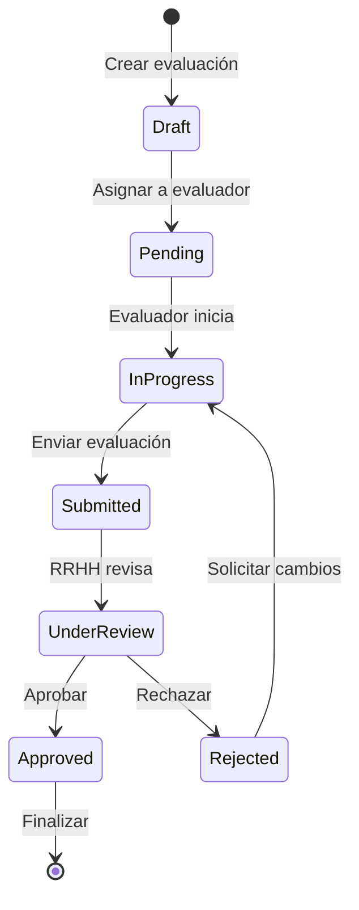
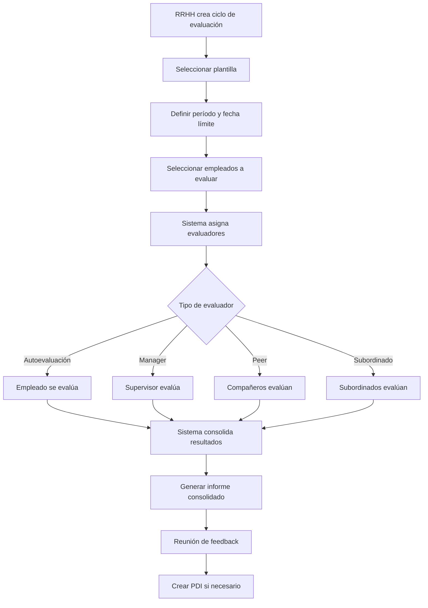

# Plan de Implementación: Dashboard Analítico y Evaluaciones de Desempeño

## Visión General

Este documento detalla el plan de implementación para dos mejoras estratégicas del sistema de gestión de RRHH:
1. **Dashboard Analítico Avanzado** - Centro de decisiones basado en datos
2. **Módulo de Evaluaciones de Desempeño** - Sistema completo de gestión del talento

---

# 📊 PARTE 1: Dashboard Analítico Avanzado

## 1.1 Objetivos

- Transformar el dashboard actual en un centro de decisiones ejecutivas
- Proporcionar KPIs de RRHH en tiempo real
- Facilitar la detección temprana de problemas
- Eliminar la dependencia de Excel para reportes gerenciales

## 1.2 Arquitectura de Componentes

### Frontend - Nuevos Componentes

```
frontend/src/components/dashboard/
├── analytics/
│   ├── KPICard.tsx              # Tarjetas de métricas con tendencias
│   ├── KPISummaryRow.tsx        # Fila de KPIs principales
│   ├── TrendChart.tsx           # Gráfico de tendencias temporales
│   ├── ComparisonChart.tsx      # Gráficos de comparación
│   ├── HeatmapCalendar.tsx      # Mapa de calor de ausencias
│   ├── DepartmentBreakdown.tsx  # Desglose por departamento
│   ├── PredictionCard.tsx       # Predicciones basadas en datos
│   └── ExportButton.tsx         # Botón de exportación
├── widgets/
│   ├── TurnoverWidget.tsx       # Widget de rotación
│   ├── AbsenteeismWidget.tsx    # Widget de absentismo
│   ├── CostWidget.tsx           # Widget de costes
│   ├── HeadcountWidget.tsx      # Widget de plantilla
│   └── HiringFunnelWidget.tsx   # Embudo de contratación
└── AnalyticsDashboard.tsx       # Página principal de analytics
```

### Backend - Nuevos Servicios

```
backend/src/services/
├── AnalyticsService.ts          # Cálculos de KPIs
├── PredictionService.ts         # Predicciones y tendencias
└── ExportService.ts             # Exportación a PDF/PPT
```

## 1.3 KPIs a Implementar

### Métricas de Plantilla
| KPI | Descripción | Frecuencia |
|-----|-------------|------------|
| Headcount Total | Número de empleados activos | Tiempo real |
| Headcount por Departamento | Distribución organizativa | Tiempo real |
| Antigüedad Promedio | Años de servicio promedio | Diario |
| Edad Promedio | Demografía de plantilla | Diario |

### Métricas de Rotación
| KPI | Descripción | Frecuencia |
|-----|-------------|------------|
| Tasa de Rotación | Bajas / Plantilla promedio × 100 | Mensual |
| Rotación Voluntaria | Renuncias voluntarias | Mensual |
| Rotación Involuntaria | Despidos/finalizaciones | Mensual |
| Tiempo de Permanencia | Días promedio antes de baja | Mensual |

### Métricas de Absentismo
| KPI | Descripción | Frecuencia |
|-----|-------------|------------|
| Tasa de Absentismo | Días ausencia / Días laborables × 100 | Semanal |
| Ausencias por Tipo | Distribución por tipo | Semanal |
| Ausencias por Departamento | Comparativa inter-departamental | Semanal |
| Coste del Absentismo | Impacto económico | Mensual |

### Métricas de Costes
| KPI | Descripción | Frecuencia |
|-----|-------------|------------|
| Coste por Empleado | Gasto total / Número empleados | Mensual |
| Coste Salarial Total | Suma de salarios brutos | Mensual |
| Coste Horas Extras | Importe de horas extras | Mensual |
| Coste de Formación | Inversión en capacitación | Trimestral |

### Métricas de Contratación
| KPI | Descripción | Frecuencia |
|-----|-------------|------------|
| Tiempo de Contratación | Días desde publicación hasta incorporación | Mensual |
| Tasa de Aceptación | Ofertas aceptadas / Ofertas enviadas | Mensual |
| Fuentes de Reclutamiento | Origen de candidatos | Mensual |

## 1.4 Visualizaciones

### Gráfico de Tendencias de Plantilla
```
┌─────────────────────────────────────────────────────┐
│  PLANTILLA - ÚLTIMOS 12 MESES                       │
├─────────────────────────────────────────────────────┤
│  120 ─┬─────────────────────────────────────────    │
│       │           ╭───╮                            │
│  100 ─┤        ╭──╯   ╰──╮      ╭──╮              │
│       │     ╭──╯          ╰─────╯  ╰──╮           │
│   80 ─┤  ╭──╯                                 ╭──╮ │
│       ├──╯                                    ╰──╯ │
│   60 ─┤                                              │
│       └───────────────────────────────────────────  │
│        E  F  M  A  M  J  J  A  S  O  N  D           │
└─────────────────────────────────────────────────────┘
```

### Mapa de Calor de Ausencias
```
┌─────────────────────────────────────────────────────┐
│  AUSENCIAS POR DÍA DE LA SEMANA                     │
├─────────────────────────────────────────────────────┤
│         L    M    X    J    V    S    D             │
│  ENE    ░    ░    ▒    ░    ▒    ░    ░             │
│  FEB    ░    ▒    ░    ▒    ▓    ░    ░             │
│  MAR    ▒    ░    ▒    ▓    ▒    ░    ░             │
│  ABR    ░    ▓    ▓    ▒    ░    ░    ░             │
│  MAY    ▒    ▒    ░    ░    ▓    ░    ░             │
│                                                     │
│  ░ Bajo  ▒ Medio  ▓ Alto  █ Crítico                │
└─────────────────────────────────────────────────────┘
```

### Embudo de Contratación
```
┌─────────────────────────────────────────────────────┐
│  EMBUDO DE CONTRATACIÓN - Q1 2025                   │
├─────────────────────────────────────────────────────┤
│                                                     │
│  Vacantes Publicadas     ████████████████████  24   │
│  Candidatos Recibidos    ████████████████     156   │
│  Entrevistas Realizadas  ██████████           48    │
│  Ofertas Enviadas        ████                 12    │
│  Incorporaciones         ███                   8    │
│                                                     │
│  Tasa de Conversión: 33% (8/24 vacantes cubiertas) │
└─────────────────────────────────────────────────────┘
```

## 1.5 Endpoints API

### Nuevos Endpoints

```typescript
// GET /api/analytics/kpis
// Retorna KPIs principales con comparativas
{
  headcount: { current: 120, previous: 115, trend: +4.3 },
  turnover: { current: 8.2, previous: 10.5, trend: -21.9 },
  absenteeism: { current: 3.4, previous: 4.1, trend: -17.1 },
  costPerEmployee: { current: 2850, previous: 2720, trend: +4.8 }
}

// GET /api/analytics/trends/:metric
// Retorna serie temporal de una métrica
// Parámetros: metric, period (month/quarter/year), start, end

// GET /api/analytics/comparison
// Comparativa entre departamentos o empresas
// Parámetros: dimension (department/company), metrics[]

// GET /api/analytics/heatmap/absences
// Datos para mapa de calor de ausencias
// Parámetros: year, groupBy (week/month)

// GET /api/analytics/predictions/turnover
// Predicción de rotación basada en tendencias

// POST /api/analytics/export
// Exporta dashboard a PDF o PowerPoint
// Body: { format: 'pdf'|'pptx', sections: [], dateRange: {} }
```

## 1.6 Modelo de Datos

### Nueva Tabla: AnalyticsSnapshot
```prisma
model AnalyticsSnapshot {
  id          String   @id @default(cuid())
  type        String   // KPI type: TURNOVER, HEADCOUNT, etc.
  period      String   // 2025-01, 2025-Q1, 2025
  dimension   String?  // department, company
  dimensionId String?
  metrics     Json     // { value: number, breakdown: {} }
  createdAt   DateTime @default(now())
  
  @@unique([type, period, dimension, dimensionId])
}
```

---

# 🎯 PARTE 2: Módulo de Evaluaciones de Desempeño

## 2.1 Objetivos

- Implementar un sistema completo de gestión del desempeño
- Facilitar evaluaciones 360° y seguimiento de objetivos
- Crear planes de desarrollo individual
- Proporcionar datos para decisiones de compensación y promoción

## 2.2 Arquitectura de Componentes

### Frontend - Nuevos Componentes

```
frontend/src/components/performance/
├── evaluations/
│   ├── EvaluationList.tsx           # Lista de evaluaciones
│   ├── EvaluationDetail.tsx         # Detalle de evaluación
│   ├── EvaluationForm.tsx           # Formulario de evaluación
│   ├── EvaluationWizard.tsx         # Wizard paso a paso
│   └── EvaluationComparison.tsx     # Comparativa de evaluaciones
├── objectives/
│   ├── ObjectiveList.tsx            # Lista de objetivos
│   ├── ObjectiveCard.tsx            # Tarjeta de objetivo
│   ├── ObjectiveForm.tsx            # Crear/editar objetivo
│   └── ObjectiveProgress.tsx        # Seguimiento de progreso
├── templates/
│   ├── TemplateList.tsx             # Plantillas de evaluación
│   ├── TemplateBuilder.tsx          # Constructor de plantillas
│   └── CompetencyLibrary.tsx        # Biblioteca de competencias
├── pdi/
│   ├── PDIList.tsx                  # Planes de desarrollo
│   ├── PDIWizard.tsx                # Crear plan de desarrollo
│   └── PDITracking.tsx              # Seguimiento de acciones
├── widgets/
│   ├── PendingEvaluationsWidget.tsx # Evaluaciones pendientes
│   ├── ObjectivesProgressWidget.tsx # Progreso de objetivos
│   └── TeamPerformanceWidget.tsx    # Rendimiento del equipo
└── PerformancePage.tsx              # Página principal
```

### Backend - Nuevos Controladores y Servicios

```
backend/src/
├── controllers/
│   ├── EvaluationController.ts
│   ├── ObjectiveController.ts
│   ├── EvaluationTemplateController.ts
│   └── PDIController.ts
├── services/
│   ├── EvaluationService.ts
│   ├── ObjectiveService.ts
│   └── PerformanceAnalyticsService.ts
├── routes/
│   ├── evaluationRoutes.ts
│   ├── objectiveRoutes.ts
│   └── pdiRoutes.ts
```

## 2.3 Modelo de Datos

### Esquema Prisma Completo

```prisma
// ============================================
// PLANTILLAS DE EVALUACIÓN
// ============================================

model EvaluationTemplate {
  id          String   @id @default(cuid())
  name        String
  description String?
  type        EvaluationType
  frequency   EvaluationFrequency
  isActive    Boolean  @default(true)
  companyId   String?
  
  sections    EvaluationSection[]
  evaluations Evaluation[]
  
  createdAt   DateTime @default(now())
  updatedAt   DateTime @updatedAt
  
  company     Company? @relation(fields: [companyId], references: [id])
}

model EvaluationSection {
  id           String   @id @default(cuid())
  templateId   String
  name         String
  description  String?
  order        Int      @default(0)
  weight       Decimal  @default(1) // Peso en la calificación final
  
  competencies EvaluationCompetency[]
  template     EvaluationTemplate @relation(fields: [templateId], references: [id], onDelete: Cascade)
}

model EvaluationCompetency {
  id           String   @id @default(cuid())
  sectionId    String
  name         String
  description  String?
  order        Int      @default(0)
  
  scale        CompetencyScale @default(FIVE_POINT)
  scaleLabels  Json?    // { 1: "Insatisfactorio", 5: "Excepcional" }
  
  section      EvaluationSection @relation(fields: [sectionId], references: [id], onDelete: Cascade)
  responses    EvaluationResponse[]
}

// ============================================
// EVALUACIONES
// ============================================

model Evaluation {
  id             String   @id @default(cuid())
  templateId     String
  employeeId     String   // Evaluado
  evaluatorId    String   // Evaluador
  evaluationType EvaluationRelationType // SELF, MANAGER, PEER, DIRECT_REPORT
  
  status         EvaluationStatus @default(DRAFT)
  period         String   // 2025, 2025-Q1, 2025-H1
  dueDate        DateTime?
  submittedAt    DateTime?
  
  // Calificaciones
  overallScore   Decimal?
  maxScore       Decimal?
  percentage     Decimal?
  
  // Comentarios generales
  strengths      String?  // Puntos fuertes
  improvements   String?  // Áreas de mejora
  goals          String?  // Objetivos para próximo período
  comments       String?  // Comentarios adicionales
  
  // Aprobación
  approvedBy     String?
  approvedAt     DateTime?
  
  template       EvaluationTemplate @relation(fields: [templateId], references: [id])
  employee       Employee @relation(fields: [employeeId], references: [id])
  evaluator      User @relation(fields: [evaluatorId], references: [id])
  approver       User? @relation(fields: [approvedBy], references: [id])
  
  responses      EvaluationResponse[]
  pdiActions     PDIAction[]
  
  createdAt      DateTime @default(now())
  updatedAt      DateTime @updatedAt
  
  @@unique([employeeId, evaluatorId, templateId, period])
}

model EvaluationResponse {
  id             String   @id @default(cuid())
  evaluationId   String
  competencyId   String
  
  rating         Int      // Valor en la escala
  comment        String?  // Justificación o comentario
  
  evaluation     Evaluation @relation(fields: [evaluationId], references: [id], onDelete: Cascade)
  competency     EvaluationCompetency @relation(fields: [competencyId], references: [id])
  
  createdAt      DateTime @default(now())
  updatedAt      DateTime @updatedAt
  
  @@unique([evaluationId, competencyId])
}

// ============================================
// OBJETIVOS
// ============================================

model Objective {
  id             String   @id @default(cuid())
  employeeId     String
  
  title          String
  description    String?
  category       ObjectiveCategory
  
  // Métricas
  targetValue    Decimal?
  currentValue   Decimal? @default(0)
  unit           String?  // %, €, unidades, etc.
  
  // Fechas
  startDate      DateTime
  endDate        DateTime
  completedAt    DateTime?
  
  // Estado
  status         ObjectiveStatus @default(NOT_STARTED)
  progress       Int      @default(0) // 0-100
  
  // Alineación
  parentObjectiveId String? // Objetivo de equipo/empresa al que contribuye
  
  // Evaluación
  weight         Decimal? @default(1) // Peso en evaluación final
  achievement    Decimal? // % de logro al finalizar
  
  employee       Employee @relation(fields: [employeeId], references: [id])
  parentObjective Objective? @relation("ObjectiveHierarchy", fields: [parentObjectiveId], references: [id])
  childObjectives Objective[] @relation("ObjectiveHierarchy")
  checkins       ObjectiveCheckin[]
  
  createdAt      DateTime @default(now())
  updatedAt      DateTime @updatedAt
}

model ObjectiveCheckin {
  id           String   @id @default(cuid())
  objectiveId  String
  
  date         DateTime @default(now())
  progress     Int      // 0-100
  notes        String?
  blockers     String?
  nextSteps    String?
  
  authorId     String
  author       User @relation(fields: [authorId], references: [id])
  objective    Objective @relation(fields: [objectiveId], references: [id], onDelete: Cascade)
  
  createdAt    DateTime @default(now())
}

// ============================================
// PLAN DE DESARROLLO INDIVIDUAL (PDI)
// ============================================

model PDI {
  id             String   @id @default(cuid())
  employeeId     String
  evaluationId   String?  // Evaluación que originó el PDI
  
  title          String
  description    String?
  
  period         String   // 2025, 2025-2026
  status         PDIStatus @default(DRAFT)
  
  startDate      DateTime
  endDate        DateTime
  
  budget         Decimal?
  
  employee       Employee @relation(fields: [employeeId], references: [id])
  evaluation     Evaluation? @relation(fields: [evaluationId], references: [id])
  
  actions        PDIAction[]
  
  createdAt      DateTime @default(now())
  updatedAt      DateTime @updatedAt
}

model PDIAction {
  id             String   @id @default(cuid())
  pdiId          String
  evaluationId   String?  // Referencia a evaluación origen
  
  title          String
  description    String?
  type           PDIActionType
  
  // Planificación
  startDate      DateTime
  endDate        DateTime
  status         PDIActionStatus @default(PENDING)
  
  // Recursos
  estimatedCost  Decimal?
  actualCost     Decimal?
  provider       String?  // Proveedor de formación
  url            String?  // Enlace a recurso
  
  // Seguimiento
  progress       Int      @default(0)
  completedAt    DateTime?
  notes          String?
  
  pdi            PDI @relation(fields: [pdiId], references: [id], onDelete: Cascade)
  evaluation     Evaluation? @relation(fields: [evaluationId], references: [id])
  
  createdAt      DateTime @default(now())
  updatedAt      DateTime @updatedAt
}

// ============================================
// ENUMS
// ============================================

enum EvaluationType {
  ANNUAL          // Evaluación anual
  SEMESTRAL       // Evaluación semestral
  QUARTERLY       // Evaluación trimestral
  PROBATION       // Evaluación de período de prueba
  PROJECT         // Evaluación de proyecto
  ADHOC           // Evaluación puntual
}

enum EvaluationFrequency {
  ANNUAL
  SEMESTRAL
  QUARTERLY
  MONTHLY
}

enum EvaluationStatus {
  DRAFT           // Borrador
  PENDING         // Pendiente de completar
  IN_PROGRESS     // En progreso
  SUBMITTED       // Enviada por evaluador
  UNDER_REVIEW    // En revisión por RRHH
  APPROVED        // Aprobada
  REJECTED        // Rechazada (requiere revisión)
}

enum EvaluationRelationType {
  SELF            // Autoevaluación
  MANAGER         // Evaluación del manager
  PEER            // Evaluación de compañero
  DIRECT_REPORT   // Evaluación de subordinado
  EXTERNAL        // Evaluación externa (cliente, proveedor)
}

enum CompetencyScale {
  THREE_POINT     // 1-3
  FIVE_POINT      // 1-5
  SEVEN_POINT     // 1-7
  TEN_POINT       // 1-10
  PERCENTAGE      // 0-100%
}

enum ObjectiveCategory {
  INDIVIDUAL      // Objetivo personal
  TEAM            // Objetivo de equipo
  COMPANY         // Objetivo de empresa
  DEVELOPMENT     // Objetivo de desarrollo
}

enum ObjectiveStatus {
  NOT_STARTED     // No iniciado
  IN_PROGRESS     // En progreso
  AT_RISK         // En riesgo
  BLOCKED         // Bloqueado
  COMPLETED       // Completado
  CANCELLED       // Cancelado
}

enum PDIStatus {
  DRAFT           // Borrador
  ACTIVE          // Activo
  COMPLETED       // Completado
  CANCELLED       // Cancelado
}

enum PDIActionType {
  TRAINING        // Formación externa
  COURSE          // Curso online
  COACHING        // Sesiones de coaching
  MENTORING       // Programa de mentoring
  PROJECT         // Proyecto de desarrollo
  ROTATION        // Rotación de puesto
  CERTIFICATION   // Certificación
  CONFERENCE      // Conferencia/evento
  READING         // Lectura recomendada
  OTHER           // Otro
}

enum PDIActionStatus {
  PENDING         // Pendiente
  SCHEDULED       // Programado
  IN_PROGRESS     // En progreso
  COMPLETED       // Completado
  CANCELLED       // Cancelado
}
```

## 2.4 Flujo de Evaluación

### Diagrama de Estados



### Proceso de Evaluación 360°



## 2.5 Interfaces de Usuario

### Pantalla Principal de Desempeño

```
┌─────────────────────────────────────────────────────────────────────┐
│  🎯 GESTIÓN DEL DESEMPEÑO                          [Nueva Evaluación]│
├─────────────────────────────────────────────────────────────────────┤
│  [Evaluaciones] [Objetivos] [Plantillas] [Planes de Desarrollo]     │
├─────────────────────────────────────────────────────────────────────┤
│                                                                     │
│  ┌──────────────────┐ ┌──────────────────┐ ┌──────────────────┐    │
│  │ 📋 Pendientes    │ │ 🎯 Objetivos     │ │ 📈 Promedio      │    │
│  │      3           │ │     67%          │ │     4.2/5        │    │
│  │  por completar   │ │  progreso equipo │ │  equipo          │    │
│  └──────────────────┘ └──────────────────┘ └──────────────────┘    │
│                                                                     │
│  EVALUACIONES RECIENTES                                             │
│  ┌─────────────────────────────────────────────────────────────┐   │
│  │ 👤 Ana García López                                         │   │
│  │    Evaluación Anual 2025 • Manager • ⭐ 4.3/5               │   │
│  │    [Ver detalle] [Crear PDI]                                │   │
│  ├─────────────────────────────────────────────────────────────┤   │
│  │ 👤 Carlos Martínez Ruiz                                     │   │
│  │    Evaluación Anual 2025 • Autoevaluación • ⏳ Pendiente    │   │
│  │    [Completar] [Recordar]                                   │   │
│  └─────────────────────────────────────────────────────────────┘   │
│                                                                     │
│  OBJETIVOS DEL EQUIPO                                               │
│  ┌─────────────────────────────────────────────────────────────┐   │
│  │ Aumentar satisfacción cliente    ████████████░░░░  75%      │   │
│  │ Reducir tiempo de respuesta      ████████████████  100% ✓   │   │
│  │ Completar certificación AWS      ██████░░░░░░░░░░  40%      │   │
│  │ Implementar nuevo proceso        ████████████░░░░  65%      │   │
│  └─────────────────────────────────────────────────────────────┘   │
│                                                                     │
└─────────────────────────────────────────────────────────────────────┘
```

### Formulario de Evaluación

```
┌─────────────────────────────────────────────────────────────────────┐
│  📝 EVALUACIÓN ANUAL 2025                                           │
│  Evaluado: Ana García López | Evaluador: Carlos Martínez            │
├─────────────────────────────────────────────────────────────────────┤
│  Progreso: ████████████░░░░░░░░ 60% (3/5 secciones)                 │
├─────────────────────────────────────────────────────────────────────┤
│                                                                     │
│  SECCIÓN 3: LIDERAZGO Y TRABAJO EN EQUIPO                           │
│  ───────────────────────────────────────────────────────────────    │
│                                                                     │
│  🎯 Comunicación Efectiva                                           │
│  Expresa ideas de forma clara y adapta su comunicación al público.  │
│                                                                     │
│  Calificación: * * * * ○  (4/5)                                     │
│                                                                     │
│  Comentario:                                                        │
│  ┌─────────────────────────────────────────────────────────────┐   │
│  │ Ana ha mejorado significativamente su comunicación con el   │   │
│  │ equipo, aunque podría trabajar más en presentaciones ante   │   │
│  │ clientes externos.                                          │   │
│  └─────────────────────────────────────────────────────────────┘   │
│                                                                     │
│  🎯 Trabajo Colaborativo                                            │
│  Colabora efectivamente con compañeros y otros departamentos.       │
│                                                                     │
│  Calificación: * * * * *  (5/5)                                     │
│                                                                     │
│  ───────────────────────────────────────────────────────────────    │
│                                                                     │
│  [← Anterior] [Guardar Borrador] [Siguiente →]                      │
│                                                                     │
└─────────────────────────────────────────────────────────────────────┘
```

## 2.6 Endpoints API

### Evaluaciones

```typescript
// GET /api/evaluations
// Lista evaluaciones con filtros
// Query: status, employeeId, evaluatorId, period, type

// GET /api/evaluations/:id
// Detalle de evaluación con respuestas

// POST /api/evaluations
// Crear nueva evaluación
// Body: { templateId, employeeId, evaluatorId, evaluationType, period, dueDate }

// PUT /api/evaluations/:id
// Actualizar evaluación (respuestas, comentarios)

// POST /api/evaluations/:id/submit
// Enviar evaluación completada

// POST /api/evaluations/:id/approve
// Aprobar evaluación (RRHH)

// GET /api/evaluations/:id/report
// Generar informe de evaluación en PDF
```

### Objetivos

```typescript
// GET /api/objectives
// Lista objetivos con filtros
// Query: employeeId, status, category, period

// POST /api/objectives
// Crear objetivo
// Body: { employeeId, title, description, category, targetValue, unit, startDate, endDate, parentObjectiveId }

// PUT /api/objectives/:id
// Actualizar objetivo

// PUT /api/objectives/:id/progress
// Actualizar progreso
// Body: { currentValue, progress, notes }

// POST /api/objectives/:id/checkins
// Crear check-in de seguimiento
// Body: { progress, notes, blockers, nextSteps }

// PUT /api/objectives/:id/complete
// Marcar objetivo como completado
// Body: { achievement, notes }
```

### Plantillas

```typescript
// GET /api/evaluation-templates
// Lista plantillas activas

// POST /api/evaluation-templates
// Crear plantilla de evaluación

// PUT /api/evaluation-templates/:id
// Actualizar plantilla

// POST /api/evaluation-templates/:id/duplicate
// Duplicar plantilla existente
```

### Planes de Desarrollo

```typescript
// GET /api/pdi
// Lista planes de desarrollo

// POST /api/pdi
// Crear plan de desarrollo

// PUT /api/pdi/:id
// Actualizar plan

// POST /api/pdi/:id/actions
// Añadir acción de desarrollo

// PUT /api/pdi/:id/actions/:actionId
// Actualizar acción de desarrollo
```

---

# 📋 PLAN DE IMPLEMENTACIÓN

## Fase 1: Dashboard Analítico (Sprint 1-3)

### Sprint 1: Infraestructura
- [ ] Crear AnalyticsService con cálculos de KPIs
- [ ] Implementar modelo AnalyticsSnapshot
- [ ] Crear endpoints de analytics
- [ ] Configurar jobs de cálculo periódico

### Sprint 2: Visualizaciones
- [ ] Implementar KPICard y KPISummaryRow
- [ ] Crear TrendChart con Recharts
- [ ] Implementar HeatmapCalendar
- [ ] Crear widgets de métricas

### Sprint 3: Exportación y Predicciones
- [ ] Implementar ExportService (PDF/PPT)
- [ ] Crear PredictionService básico
- [ ] Integrar todo en AnalyticsDashboard
- [ ] Testing y refinamiento

## Fase 2: Evaluaciones de Desempeño (Sprint 4-7)

### Sprint 4: Modelos y Plantillas
- [ ] Implementar modelos de datos Prisma
- [ ] Crear EvaluationTemplateController
- [ ] Implementar TemplateBuilder en frontend
- [ ] Crear CompetencyLibrary

### Sprint 5: Evaluaciones
- [ ] Implementar EvaluationController y Service
- [ ] Crear EvaluationWizard
- [ ] Implementar flujo de estados
- [ ] Crear sistema de notificaciones

### Sprint 6: Objetivos
- [ ] Implementar ObjectiveController y Service
- [ ] Crear gestión de objetivos
- [ ] Implementar check-ins
- [ ] Crear visualización de progreso

### Sprint 7: PDI e Integración
- [ ] Implementar PDIController y Service
- [ ] Crear PDIWizard
- [ ] Integrar evaluaciones con PDI
- [ ] Testing y documentación

---

## Métricas de Éxito

### Dashboard Analítico
- Tiempo de carga de KPIs < 2 segundos
- 80% de managers utilizan el dashboard semanalmente
- Reducción del 50% en solicitudes de reportes manuales

### Evaluaciones de Desempeño
- 90% de evaluaciones completadas en plazo
- Tiempo promedio de evaluación < 30 minutos
- 70% de empleados con PDI activo después de evaluación
